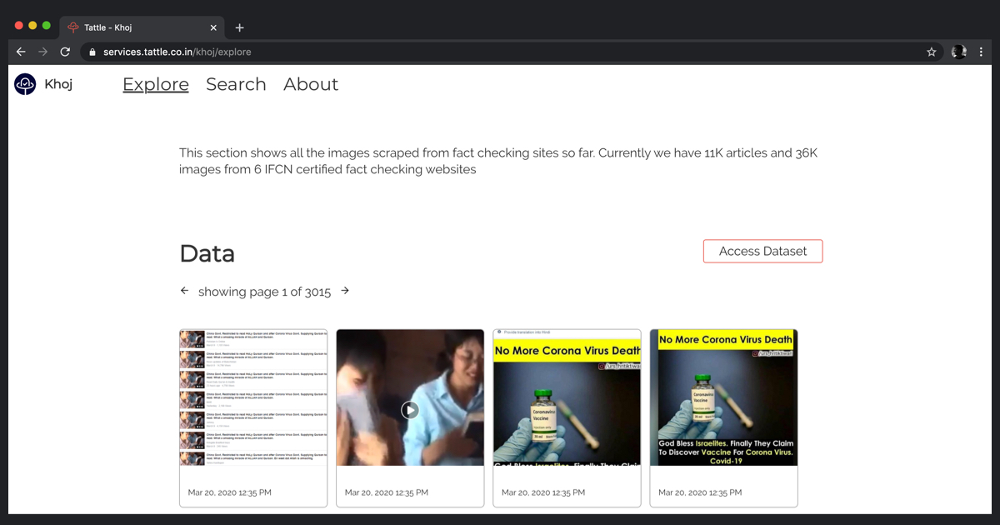

## The Need

Fact checkers play an important role in debunking the daily deluge of misinformation spread on social media and chat apps. As individuals who use chat apps and fact checking sites, we realized that the fact checked articles reach significantly fewer people than the misinformation itself. Increasing the discoverability and reach of fact checked content can go a long way in shortening the lifecycle of a misinformation.

## Tattle Search

To begin addressing this need we are releasing the first version of our Fact Check Search Service - Khoj. Our goal with this service is to make it easy for anyone to submit a message they receive (text, image, video, url) and find stories from fact checking sites tackling this message.

For users with low tech literacy, being able to search in the modality of the messages received is essential to accessing information. Hence by combining the use of machine learning and human made annotations we aim surface high quality search results for media submitted by our users. 

In our current version we only support search via images. Keep checking this space for updates on new features.

## Current Features

Features of our service are primarily arranged into two tabs - Explore and Search. 

Explore offers visibility into the data we are collecting from fact checking websites. It could be of interest to researchers trying to study patterns in content on WhatsApp. It could also be used to investigate the underlying data for inconsistencies and errors. 

Search lets users upload images and search our index of fact checked articles. 

gif showing a user dragging and dropping a message they received into Khoj

We return all matching fact checked articles that feature images that match the uploaded image exactly or approximately.
Examples of what our system tries to treat as 'similar' images
## Releasing soon

Over a period of next two weeks we will release ability to search via videos, text and keywords to find fact check articles. We’ll also be incorporating user feedback in that time. The Search service will also be exposed via a REST API for other third party app developers to build on top of. 

## Call for help/feedback

This service requires regular feature development and maintenance to ensure high quality results. Our core team works full time on maintaining it but we could always use assistance and volunteers to increase the efficiency of our model. If you’d like to contribute by contributing to the codebase, annotating, stress-testing the data for access, or get early access to our REST API please reach out to us at admin@tattle.co.in.

---

You can use Khoj here  - [https://services.tattle.co.in/khoj](https://services.tattle.co.in/khoj)
