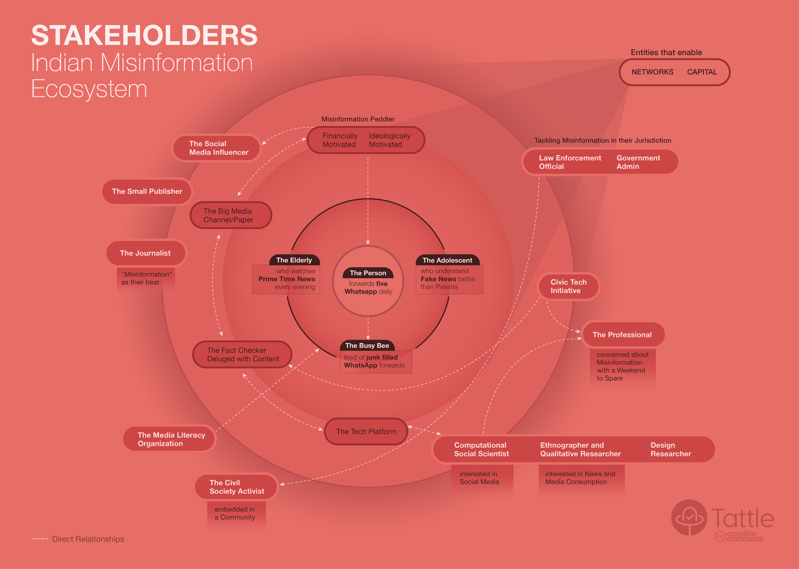
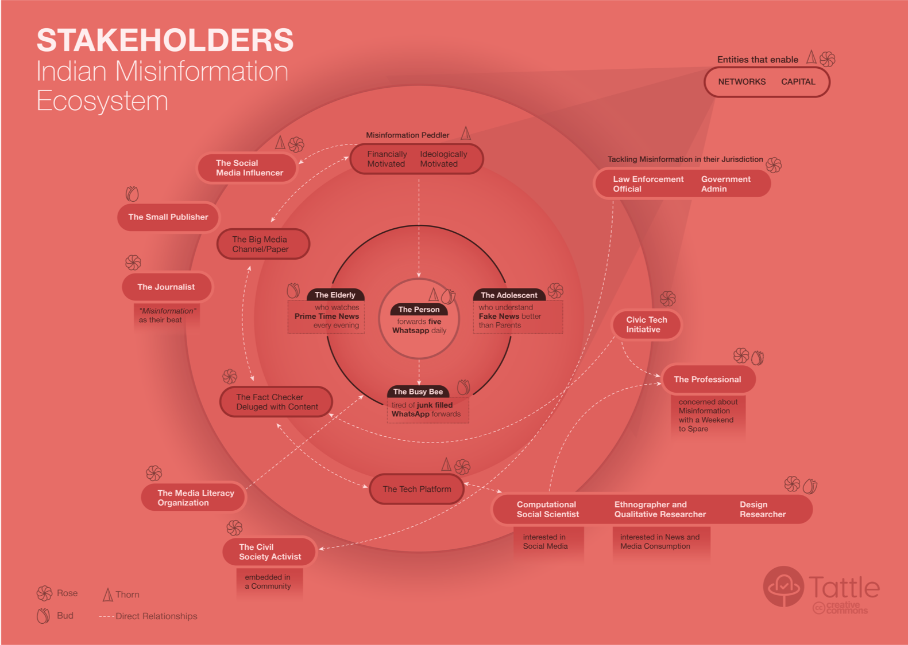

Over the last two years we've spent several weekends thinking, discussing and prototyping ideas for citizen driven action on misinformation. But it is hard to discuss civic action, without talking about the other actors in the misinformation ecosystem. Civic action is ultimately shaped by and must respond to actions of other actors in the space. 

We decided to borrow from design thinking methodology and use a stakeholder map as a way to list down the key actors and map the relationships between them. There are more [extensive blogs](https://uxdict.io/design-thinking-stakeholder-maps-6a68b0577064) on why stakeholder mapping is useful in a design process. But here we’ll share some of the reasons why we found the exercise useful:

1. It helped bring everyone on the same page about the different actors in the misinformation space and how we individually prioritized them.
2. It became our go to reference document for all future ideation exercises. When designing a feature, we could explicitly point who that feature was being designed for.
3. We found it useful in external communications. When explaining to people why we were building what we were, we could explain how it would relate to their work.

The third point is the raison d'etre for this blog. In our experience, introducing the stakeholder map in any external meeting, quickly focussed the conversation. People found the map useful in talking about their ideas and workflows too. Through consecutive meetings we realized that this map could perhaps find utility outside of Tattle, as well. We've edited the original map so that it would be more palatable for wider consumption. We’ve left out some stakeholders altogether, and have clubbed multiple different stakeholders, say different roles inside a fact checking group, into one stakeholder. For that we have our designer to thank. She took our rough sketch and turned it into this condensed and concise stakeholder map:
[Stakeholders in the Indian Misinformation Ecosystem](https://tattle-media.s3.amazonaws.com/stakeholder_map.png)
## How To Read This Map

Let us begin with a caveat- there is no one way to draw a stakeholder map. And there are multiple ways of aggregating a granular map. Tattle’s stakeholder map is centered around the individual who loves forwarding content on chat apps such as WhatsApp. It is this individual that Tattle ultimately hopes to connect to better information. But a stakeholder map could also have been drawn with the tech platform or the misinformation peddler at the center.

We have organized the stakeholders in a circle, to reflect level of importance. The further away a stakeholder is from the center on the map, the less direct is their relationship to the ‘Individual who Sends Five WhatsApp Messages Daily’. The white arrow reflects a direct relationship between different stakeholder. This relationship could be a collaborative relationship, a competitive one or a client relationship. The arrowhead reflects the direction of dependency. A double-sided arrow reflects a mutually supporting relationship. Realistically, every stakeholder in this map is connected with every other stakeholder- they all inevitable interact with each other in some way. We’ve chosen to highlight the ones that are most salient.

## What You Can Glean from The Map

The innermost circle shows the every day chat app user and news consumer. This person might be especially susceptible to misinformation and readily forwards messages they see. Or this person might be the social media savvy adolescent who can spot potentially fake news as soon as they see it. Or this person might be that one who is deluged by WhatsApp forwards, is tired of them, but is too busy to verify and respond to all of them. All of these are either affected by, contribute to or can respond to misinformation they see around them. 

The next circle reflects stakeholders that target the inner circle (the every day news consumers and the chat app users). This circle includes the ideologically or financially motivated misinformation peddler, the big media channels, the independent fact checking groups, and the tech platforms on which messages are circulated. 

Further out are stakeholders who can be engaged in efforts around misinformation, but don’t produce or curate content for every day news consumers and chat app users. These can be researchers working in the space of misinformation, media literacy organizations, law enforcement, community activists or civic tech initiatives (such as Tattle). 

Finally, there is a super stakeholder that amplifies the work of every other stakeholder in the map- this stakeholder is one who can provide network or capital.

## Rose, Thorn, Bud

We can add another layer on this map, to label all the stakeholder who abet misinformation (thorns), those who work to reduce it (roses), and those who currently don't don’t but could potentially help in the fight against misinformation (buds).

### Roses in the Ecosystem:

These are stakeholders who constitute a defense mechanism against misinformation. These include:

- The adolescents who understands online media better than their parents and can inform their parents about potential misinformation.
- The Fact checking groups debunking content.
- The social media influencers, when they amplify accurate information.
- The researchers trying to understand propaganda.
- Law enforcement agencies such as police officers tackling misinformation in their jurisdiction.
- Tech platforms when they actively try to curb misinformation.

### Thorns in the Ecosystem:

- The people who forward content without checking it.
- The misinformation peddlers (the biggest thorns of all!).
- The tech platforms when they allow misinformation to proliferate on their platforms.
- The social media influencers who spread content often generated by misinformation peddlers.
- Entities that amplify work of misinformation producers and other thorns in the ecosystem. (The can be roses when they do the opposite)

### Buds in the Ecosystem:

- The person tired of WhatsApp forwards but who doesn’t act on it. This person, with the right tools, and information, could be motivated to seed accurate information in the messaging conversations they are a part of.
- The elderly who watch prime time news in the evening (that might also often contain inaccurate stories). Like the previous person, they too can inform the conversations they are a part of.
- Small publishers who at the moment aren’t actively engaged in the misinformation space.
- Researchers from different backgrounds, whose disciplinary training could inform our understanding of misinformation.

This stakeholder map reflects our overall optimism that the roses and the buds in this ecosystem far exceed the thorns. Which is to say- that there is a lot of energy that can be channelized in the fight against misinformation.

Do reach out to us with feedback or if you'd like to discuss a more granular stakeholder map. 
