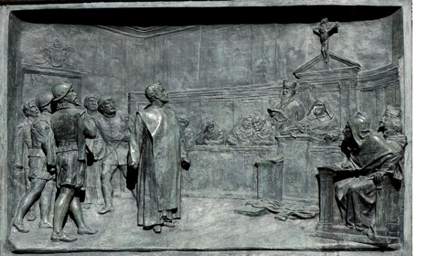
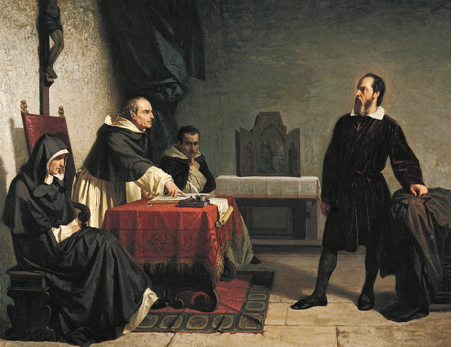

## जब से प्रिंटिंग, तब से फ़ेक न्यूज़

माना जाता है कि फ़ेक न्यूज़ का इतिहास, कम से कम प्रिंटिंग प्रेस के इतिहास जितना पुराना तो है ही। जब साल 1439 में, गूटेन्बर्ग ने प्रिंटिंग प्रेस का आविष्कार किया था तभी से फ़ेक न्यूज़ का प्रचार और प्रसार शुरू हो गया था। 16वीं और 17वीं सदी के दौरान प्रकाशक ऐसे पैम्फ़्लेट्स और ख़बरों के पर्चे छापा करते थे जिनमें विशालकाय दैत्यों और अप्रत्याशित घटनाओं का विस्तार से उल्लेख हुआ करता था। कैटेलोनिया(स्पेन का एक हिस्सा) में 1654 में एक रिपोर्ट प्रकाशित हुई थी जिसके अनुसार एक ऐसा राक्षस मिला है जिसके बकरी जैसे पैर हैं, इंसान जैसा शरीर है, सात हाथ हैं और साथ सिर है।

स्पेन के केटालोनिया में छपी फ़ेक न्यूज़ की तस्वीर

ये बातें झूठ थी, लेकिन जब प्रकाशकों से इसके बारें में पूछा गया तो उन्होंने ये कह कर इस मसले से अपने हाथ धो लिए कि उनका काम केवल एक ऐसा मंच देने का था जिससे सूचना के प्रचार और प्रसार में सुविधा हो। सूचनाओं की वैधता या वास्तविकता के पैमानों को तय करना  उनका काम नहीं था।

## प्रिटिंग प्रेस के आने से पहले आई फ़ेक न्यूज़

हालाँकि प्रेस के आगमन से पहले भी इतिहास और हमारी कहानियों में फ़ेक न्यूज़ के कई क़िस्से दर्ज हैं। शायद फ़र्क़ सिर्फ़ ये है कि तब उन्हें फ़ेक न्यूज़ नहीं कहते थे। इसापूर्व पहली सदी के दौरान, रोमन सेना के लीडर अगस्तस ने अपने प्रतिद्वंदी मार्क ऐंटॉनी के ख़िलाफ़ अफ़वाहों और दुष्प्रचार का एक अभियान चलाया था। इस अभियान के चलते, मार्क ऐंटॉनी पर तरह तरह के इल्ज़ाम लगाए गए थे। उन्हें शराबी, व्याभिचारी और रानी क्लीओपेट्रा के हाथों की कठपुतली भी कहा गया। भारतीय पुराणों में भी अफ़वाहों का ज़िक्र होता है। महाभारतकेयुद्धकेसमयकुरुक्षेत्रकीरणभूमिपर*, *कृष्णनेगुरुद्रोणकोपरास्तकरनेकेलिएपांडवोंकोसुझावदियाकिहमेंद्रोणाचार्यऔरकौरवोंकेखेमेकामनोबलतोड़नाहोगा।तबकृष्णनेयुधिष्ठिरसेकहलवाया*, “*अश्वत्थामाहतोनरोवाकुंजरो*” *अर्थातपतानहींकिअश्वत्थामानामकहाथीयामनुष्यकौनमारागयाहै।गुरु द्रोणाचार्य के पुत्र का नाम ‘अश्वत्थामा‘ था। इस संदेश के फैलते ही गुरु द्रोणाचार्य का मनोबल टूट गया और वह युद्ध भूमि में कमज़ोर पड़ गए।  अन्यथा महाभारत के युद्ध में गुरु द्रोण की मृत्यु लगभग असम्भव थी। उनकी मृत्यु को आसान बनाने के लिए कृष्ण ने यह छल किया था।शायदआजकेसंदर्भमेंकोईफ़ैक्टचेकिंगसंस्थान*, *इसबातको फ़ेकन्यूज़भीकहसकतीहै।

साल* 1475 *में*, *इटलीकेट्रेंटशहरमें*, *सिमोनियोनामकाएकढाईसालकाबच्चालापताहोजाताहै।एकफ़्रांसीसीउपदेशक*, *बर्नार्डिनोदावाकरतेहैंकीयहूदीसमुदायनेबच्चेकीहत्याकर*, *उसकाख़ूननिचोड़करऔरअपनेपासओवर* (Passover) *पर्वकेदौरानउसख़ूनकोपीलियाथा। इसके बाद उन्होंने इस बात का भी प्रचार किया कि बच्चे की लाश, एक यहूदी के घर के तहख़ाने में मिली थी। इन अफ़वाहों का नतीजा यह हुआ कि, आदेश जारी हुए की पूरे यहूदी समुदाय को बंदी बनाकर कड़ी से कड़ी सज़ा दी जाए। अंत में 15 यहूदियों को जला दिया जाता है।
सिमोन ऑफ ट्रेंट की एक मूर्ति
आजभीसिमोनकोईसाईधर्मकीकईमान्यताओंऔरकहानियोंमेंसिमोनऑफट्रेंटकेतौरपरजानाजाताहै*, *उसकीमूर्तियांबनतीहैंऔरइसकोलेकरयहूदियोंकोनिशानाबनायाजाताहै।इतिहासकारों का मानना है कि नाज़ी जर्मनी में जो यहूदियों के ख़िलाफ़ जो माहौल था, उसकी जड़ें इन कहानियों में छुपी हुई हैं। यहां तक कि इस कहानी को नाज़ियों ने भी अपने दुष्प्रचार में इस्तेमाल किया। मतलबफ़ेकन्यूज़कोफैलानेवालेऔरइसकेपीड़ितोंकीमृत्युकेसदियोंबादभीफ़ेकन्यूज़काजीवनकालव्याप्तरहसकताहै।

## लेकिन अब तो पूरा फ़ेक न्यूज़ युग है..

वर्तमान की फ़ेक न्यूज़ और अफ़वाहों ने एक अलग आयाम और रूप ले लिया है। ये अपने आप में एक इतनी बड़ी समस्या बन गयी है कि साल* 2016 *मेंऑक्सफ़ोर्डडिक्शनरीने* “Post-Truth” *कोअपनेशब्दकोशमेंशामिलकियाथा।ऑक्सफ़ोर्डडिक्शनरीकेमुताबिक़पोस्टट्रुथ* (Post-Truth) *काअर्थथाएकऐसावक़्तयायुग*, “*जिसकासम्बन्धऐसीपरिस्थितियोंसेहोजहाँलोक*-*मतयाजनताकीरायबनानेमेंतथ्योंऔरवास्तविकताकाबहुतकमयोगदानऔरप्रभावरहताहै।*”*लोगों की भावनाएँ और निजी विचार, जनता की सम्मति को प्रेरित करते हैं।“*Post-Truth” * का तात्पर्य ये नहीं है कि अब सच के कोई मायने नहीं हैं या कोई सच मानता नहीं है या कोई सच मानना नहीं चाहता या सच का कोई अस्तित्व नहीं है।ना तो हमें यह मानना चाहिए कि ये दौर सच के परे है और ना ही यह कि ये सच के बाद का दौर है। बल्कि, ये एक ऐसा दौर है जहाँ सच मुश्किल में है, जहाँ सच को ना देख पाने या सच के ना सामने आने की सम्भावना बहुत ज़्यादा है। मुमकिन है कि, यह एक ऐसा वक़्त हैं जहाँ वास्तविकता, बहुसांख्यिक सत्ता पक्ष  और  भावनात्मक विचारों के अधीन है। आख़िर क्यों है सच जोखिम में? क्या होती है फ़ेक न्यूज़ और क्यों ये फैल पाती है? क्यों हम लोग कुछ बातों को बिना सबूत के सच मान लेते हैं?क्यों हम हमेशा एक ही तरह की ख़बरें या एक ही प्रकार के प्रसंगों को सच मान लेते हैं?

## झूठ, आधा-सच या तथ्यों का विकल्प

ठीकसाल* 1600 *ईसवींमेंरोमकेएकभीड़भरेबाज़ारमें*, *एकशख़्सकोउल्टालटकाकर* – *उसकोगालियांदीजारहीथी।भीड़खड़ेहोकरइसविधर्मीकेअंतकातमाशादेखनेकोउत्सुकथी।उसकीज़ुबान*, *कैथोलिकचर्च*, *ईसाऔरमहानवेटिकनकेख़िलाफ़बोलनेकेआरोपमेंसिलदीगईथी।कुछहीदेरमेंउसकेशरीरकोआगलगादीगई।आगकीलपटोंमेंगिरे*, *जलतेऔरअपनेनिर्ममअंतकीओरजाते* – *ब्रूनो* – *गिआर्डिनोब्रूनोकाकुसूरयेथाकिउसकेदावाकियाथाकिधरती*, *सूरजकेचारोंओरपरिक्रमाकरतीहै* – *जबकिकैथोलिकचर्चकामाननाइसकेठीकउलटथा।
ब्रूनो को सज़ा
प्रसिद्धवैज्ञानिकगैलीलियोनेजबयहीदावाकियाकि*, *पृथ्वीसूरजकेचक्करकाटतीहै*, *औरपृथ्वीनहींसूरजहमारेसौरमंडलकाकेंद्रहै*, *तबउनपरभीयहीइल्ज़ामलगायागयाथा।उनकीबातोंकोविधर्म* , *झूठऔरपाखंडकहागयाथा।फ़र्कबसयेथाकिउनकोज़िंदाछोड़दियागयाऔरता*-*उम्रघरमेंक़ैदकरदियागया। उनके द्वारा लिखी गयी चीज़ों के प्रकाशन पर रोक लगा दी गयी थी। उनकी बातें अंततः सच साबित हुई पर क्योंकि उनकी बातों ने समाज की प्रबल आवाज़ यानी कि चर्च को चुनौती दी थी – उनकी बातों को झूठ क़रार दे दिया गया। लेकिन एक और बात हुई, गैलीलियो की घटना के बाद ,तथ्यों और उनके सूत्रों पर एक बड़े स्तर पर विचार विमर्श होने लगा। तो क्या धर्म या प्रबल या प्रबुद्ध विचारों के ख़िलाफ़ बोलना, झूठ होता है? आख़िर सच, झूठ, आधा सच, पूरा झूठ होते क्या हैं? आख़िर सूत्रों, तथ्यों को कैसे समझा जाए? इन सवालों पर आने से पहले, वर्तमान समय की थोड़ी बात कर लेते हैं।
गैलीलियो की सुनवाई
साल* 2015 *मेंतथ्योंकीजाँचपड़तालकेलिएएकअंतराष्ट्रीयसंगठनकीस्थापनाहुई।इससंगठनको* IFCN (International Fact Checking Network) *भीकहतेहैं।यहसंगठन* fact checking *संस्थानोंकोमान्यतादेताहैऔरउनकेलिएनियम*, *क़ानूनयामापदंडतयकरताहै।इस दौर में फ़ेक न्यूज़ या अफ़वाहों की जाँच करने वाले कई संस्थानो का गठन हुआ है। भारत में भी लगभग 14 ऐसी कम्पनियाँ हैं जो फ़ेक न्यूज़ से लड़ने का काम कर रही हैं। ऑल्ट न्यूज़, बूम, विश्वास न्यूज़ उनमें से प्रमुख संस्थाएँ हैं। इन सबके बावजूद आज फ़ेक न्यूज़ एक बहुत बड़ी समस्या है। क्यों झूठ पकड़े जाने की सम्भावना के बावजूद नेता, देशों के प्रमुख लगातार झूठ या तथ्यों को तोड़ मरोड़ कर पेश करते रहते हैं? उदाहरण के तौर पर जब राष्ट्रपति ट्रम्प का चुनाव हुआ था तो उन्होंने कहा कि, राष्ट्रपति रीगन के बाद ये सबसे बड़ी चुनावी जीत थी। जबकि ऐसा नहीं था। उन्होंने कहा कि, उनके अभिषेक के उत्सव में इतिहास की सबसे बड़ी भीड़ इकट्ठी हुई थी। जबकि तस्वीरों में ऐसा कुछ नज़र नहीं आता है। प्रधानमंत्री मोदी ने अपनी चुनाव रेलियों में दावा किया की DBT (Direct Benefit Transfer) की योजना उनकी सरकार ने शुरू करी थी किंतु इस योजना की शुरुआत तो साल 2013 में ही हो गयी थी। इन सबको हम झूठ की कैटेगरी में डाल सकते हैं। पर आधे सच तो और भी दिलचस्प होते हैं जैसे कि ट्रम्प ने कहा कि उनके CIA के भाषण के दौरान, सब लोगों ने खड़े होकर उनको तालियाँ और सराहना दी, किंतु सच तो ये था की उस मीटिंग के दौरान ट्रम्प ने CIA के स्टाफ़ को बैठने की अनुमति ही नहीं दी थी। पर फिर क्यों ये नेता इतने मशहूर हैं – ट्रम्प के समर्थकों को जब ट्रम्प के झूठ बताए जाते हैं तो वो ये कहकर पल्ला झाड़ लेते हैं की ट्रम्प की बातों को गम्भीरता से लेना चाहिए ना की वस्तुतः तौर से।मतलब उनके हर शब्द पर नहीं बल्कि उनकी समस्त बात पर ध्यान देना चाहिए।

## (अ)विश्वास से (अंध)विश्वास तक

आख़िरसबूतों*, *तथ्यों*, Fact Check *केबावजूदझूठयाआधेपौनेसचोंपरक्योंभरोसाकियाजाताहै*? *[शोधकर्ताओं](https://pdfs.semanticscholar.org/9a0d/42b018cc283579b39ba133bbd1a4a87825e6.pdf)केअनुसारइसकेमुख्यतौरपरचारकारणहोतेहैं* – *उत्तेजितयाप्रेरिततर्कशक्ति* (Motivated Reasoning), *पुष्टीकरणकापूर्वाग्रह* (Confirmation Bias),*आसानीसेमिलनेवालीबातेंऔरअनुमान* (Available Heuristics) *औरमुख्यधाराकीबातें* (Salience)*।

उत्तेजितयाप्रेरिततर्कशक्ति की वजह से जब हमें हमारी धाराणाओं  के विपरीत या उनसे अलग कोई तर्क या डेटा दिया जाता है तो हमको मानसिक असहजता का अनुभव होता है। उस नए डेटा को मानने से ज़्यादा हमें उसको ख़ारिज करने में आसानी होती है। जैसे कि मान लीजिए हमको बार बार कहा जाता है कि हिन्दू बहुत लिबरल और सहनशील है क्योंकि हमारे देश की मजॉरिटी ने मुस्लिम राष्ट्रपति, मुस्लिम अभिनेताओं, मुस्लिम लोगों को अपनाया है।चलिएमानलेतेहैंयेसचहै*, *तोफिरतोजबमुग़लशासकोंनेराजपूतमहिलाओंसेशादीकरीयाआमेरकेकच्छवाहाराजपूतोंकोअपनीसेनामेंसबसेबड़ेपददिए* – *इसहिसाबसेतोवोभीबहुतसहनशीलहुए*? *दूसराहमेंलगातारबतायाजाताहैकीमुग़लोंनेभारतकोलूटा*-*पर* 1600 *और*  1700 *सदीमेंजबभारतमेंमुग़लोंकाशासनथातबतोभारतकी* GDP , *विश्वमेंक्रमानुसारपहलेऔरदूसरेपायदानपरथी।तोफिरलूटकरउन्होंनेशायदनिवेशवापिसभारतमेंहीकरदियाहोगा*? *इस डेटा के बावजूद हम अपने विचार नहीं बदल पाते क्योंकि उस प्रक्रिया में हमें अपने पुराने विचारों और भावनाओं से दूर होना होगा, जो की बहुत कष्टदायी अनुभव होता है और जिसमें बहुत मेहनत लगती है।

पुष्टीकरणकापूर्वाग्रह की वजह से हम वो ही किताबें, ख़बरें, कहानियाँ ढूँढते हैं जो हमारी वर्तमान धाराणाओं से सहमति रखते हों।ना सिर्फ़ सूचना खोजने में हम अपने पूर्वाग्रहों पर निर्भर होते हैं, पर जो सूचना हमारे सामने आती है उसको हम अपने हिसाब से समझ भी लेते हैं। जैसे कि नाज़ीजर्मनीमेंयहूदियोंकेख़िलाफ़रेडियोपरलगातारदुष्प्रचारकियाजाताथा*, *परउसकादुष्प्रभावसिर्फ़उनइलाक़ोंमेंदेखनेकोमिलाजोपहलेसेहीयहूदियोंकेख़िलाफ़थे।
नाज़ी जर्मनी में यहूदियों के ख़िलाफ़ कैम्पेन
**मुख्यधारा की बातें(salience**) – वैज्ञानिकोंकेअनुसारहमारेपाससीमितमानसिकक्षमताएँऔरयादाश्तहोतीहै।तोहमारेसामनेअगरदसतरहकीबातेंहैं*, *हमसिर्फ़कुछबातोंपरध्यानदेतेहैं।इसलिएनेताकभीकभारउन्हीमुद्दोंकेबारेंमेंबातकरतेहैंजिनसेलोगउत्तेजितहोजाएँ।फिरफ़र्क़नहींपड़ताकीउनमुद्दोंपरकिसीनेतानेसचकहाकीझूठ। क्योंकि मुद्दा ज़रूरी हो जाता है, मुद्दे पर क्या कहा और किया गया वो नहीं। जैसे नोटबंदी के दौरान काला धन का मुद्दा महत्वपूर्ण हो गया, पर काला धन आया की नहीं उस पर बहुत कम लोगों ने ध्यान दिया। साल 2019 में जब 4 मुख्याधाराओं के टीवी चैनलों की [202](https://www.nationalheraldindia.com/india/14-debates-on-ram-mandir-66-attacking-opposition-but-none-on-the-economy-four-hindi-news-channels) डिबेट्स का एक विश्लेषण किया गया तब पता चला की *79 *डिबेट्सपाकिस्तानकेऊपरथी*,  66 *विपक्षपरप्रहारकरतेहुएथी*,  14 *डिबेट्सराममंदिरकेमुद्देपरथीऔर* 36 *डिबेट्स* RSS/*मोदीजीकीप्रशंसाकरतेहुएथी।मतलब इससे कोई फ़र्क़ नहीं पड़ता की ये मुद्दे ज़रूरी हैं की नहीं, लेकिन क्योंकि सिर्फ़ इनही मुद्दों पर बात हो रही है तो ये मुद्दे अपने आप ज़रूरी लगने लग जाते हैं।

**आसानी से मिलने वाली बातें और अनुमान (*available heuristics) ***– सोशल मीडिया के अलगोरीथमस हमें लगातार उसी तरह की बातें दिखाते हैं जिनसे हम सहमत हो। तो हमें अपनी बातों को सही सिद्ध करने के लिए आसानी से वही तर्क मिल जाते हैं जिनसे हम पहले से ही सहमत हो।

## फ़ेक न्यूज़ का दोषी कौन?

तो ना केवल फ़ेक न्यूज़ फैलाने वाले लोग इस झूठ के कारोबार के ज़िम्मेदार हैं, लेकिन जिस तरह हम चीज़ें ढूँढते हैं, याद करते हैं, भूल जाते हैं, पढ़ते हैं, सुनते हैं – हम फ़ेक न्यूज़ से सिर्फ़ पीड़ित ही नहीं उसके दोषी भी है। बचपन में एक खेल खेलते थे चायनीज़ विस्पर जिसमें एक आदमी दूसरे के कान में कुछ फुसफुसा देता था, ऐसे करते करते जब वो बात फिर से पहले आदमी तक आती थी, तो वो कुछ और ही स्वरूप ले लेती थी।हो सकता है आपने ग़लत सुना हो, हो सकता है आपने ग़लत समझा हो, हो सकता है आपने आधा सुना हो, हो सकता है आप सुनकर भूल गए हो-फ़ेक न्यूज़ भी कुछ इसी तरह फैलती है।दूसरे के ग़लत होने के साथ साथ आपके ग़लत होने की भी पूरी सम्भावना है।
