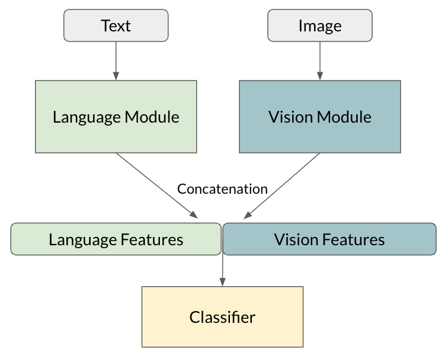

Some time ago, the Tattle team began exploring how the emerging area of 'multimodal machine learning' might help our work. Communication (including misinformation) on chat apps and social media spreads via multiple modalities like image, text, video. Many Indians are also multilingual. Consequently, "meaning” is communicated through combinations of modes and codes when Indians communicate on platforms such as Whatsapp, Sharechat, Facebook etc. This is amply clear in the content we collect from our various data streams.

Source: [Tattle archive](https://tattle.co.in/products/kosh)

### Tattle's use case

Our need for ML is driven by the volume of data we collect (currently over 5k multimedia messages/posts/articles per day) which makes it impractical to perform tasks like content classification and archive moderation manually. Not only do we need to automate such tasks, we need to automate them regardless of the media type and language of the data.

Multimodal ML allows us to do this without separating the modalities in a message/post and losing "meaning" in the process. It combines Computer Vision and Natural Language Processing to "learn" patterns and semantic relationships in multimedia content. The process of combining machine-generated representations of images and text is called fusion.

### A quick summary

Here is a top level view of a multimodal ML pipeline that uses fusion to classify images and text into categories. Tattle's pipeline closely resembles this structure -

Source: [https://www.drivendata.co/blog/hateful-memes-benchmark/](https://www.drivendata.co/blog/hateful-memes-benchmark/)

In a nutshell, this is how it works:

Suppose we want to classify some multimedia content (eg. image overlaid with text like the Bill Gates post above). After extracting the text from the image*, the image and text go through separate pre-processing pipelines**. The pre-processed image is then passed through a neural network (vision module) and the pre-processed text is passed through another neural network (language module). The output 'features' of both modules are then concatenated (fused) together and passed through some final neural network layers, which generate a classification (category label).

In the case of our content relevance pipeline, this label is either 1 (potential misinformation) or 0 (not potential misinformation). This pipeline helps us improve the quality of the Tattle archive.

We are working on improvements to the model - if you'd like to contribute or view the code, please visit the [GitHub repository](https://github.com/tattle-made/content-relevance/branches) for this project.

*Text extraction is done via Optical Character Recognition

**Multilinguality is handled during the text pre-processing stage. Our approach towards Indian language content will be covered in another blog post.
