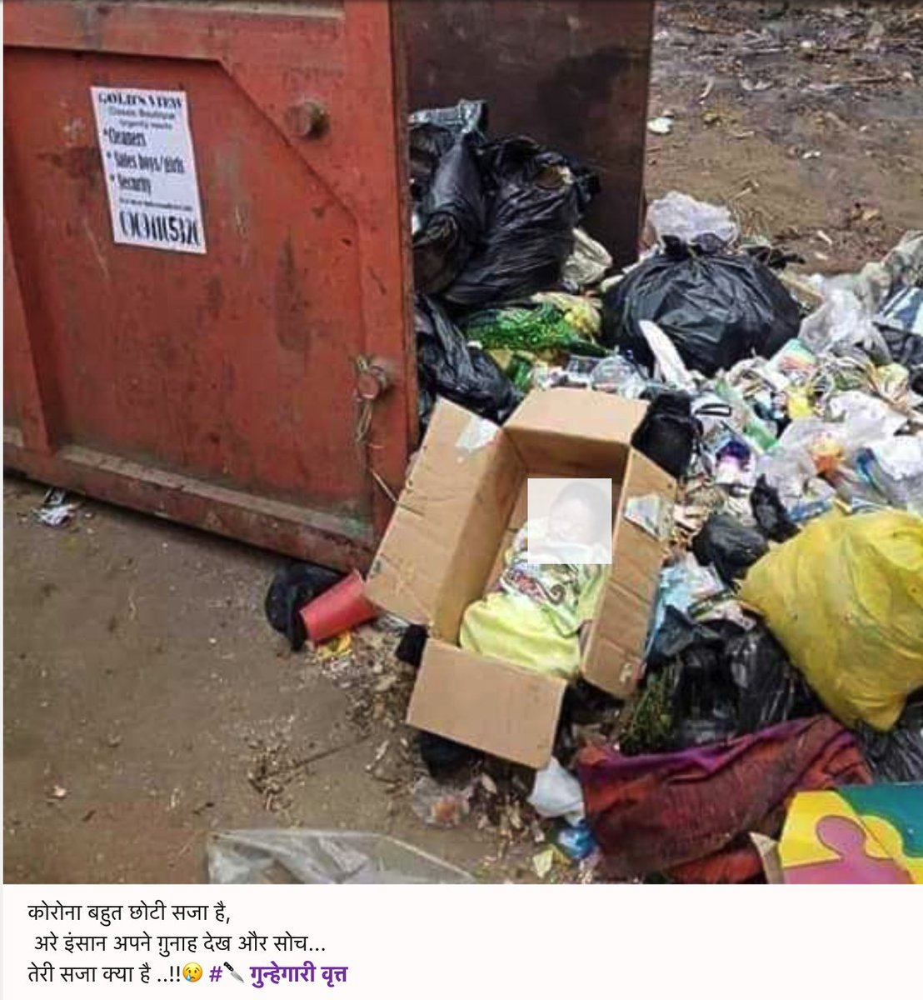

एक बार ऑनलाइन शेयर होने के बाद, बिना किसी संदर्भ/स्रोत वाला कंटेंट/तस्वीरें/विडीओज़ अपना जीवन ख़ुद ही ढूँढ लेते हैं। धीरे-धीरे,बिना ध्यान में आए,थोड़ा-थोड़ा कर ऐसी चीज़ें कब फ़ेक न्यूज़ बन जाती है पता नहीं चलता।इसका बड़ा कारण यह है कि किसी भी कंटेंट को अपने मूल प्रसंग से दूर बिलकुल भिन्न या ग़लत संदर्भ में भी शेयर किया जा सकता है।

उदाहरण के लिए, पिछले हफ़्ते भारतीय चैटिंग प्लेटफ़ॉर्म पर वाइरल हुआ यह पोस्ट  ~600 बार शेयर हुआ और  ~2400 बार लाइक किया गया। इसको साझा करते वक़्त यह भी लिखा गया कि  “कोरोना बहुत छोटी सजा है, अरे इंसान अपने गुनाह देख और सोच तेरी सजा क्या है!”

परंतु गूगल की एक बुनियादी सर्च करे तो इस फोटो का एक उल्लेख नाइजीरिया की Rapid Gist साइट पर मार्च 2020 में भी दिखाई देता है, जिसके मुताबिक़ 15 मार्च को यह बच्चा नाइजीरिया के एक शहर में लावारिस पाया गया था।लेकिन इससे पहले भी भारत में यह पोस्ट लगातार अलग-अलग संदेशों के साथ भी साझा किया गया है। जैसे की इसे फ़ेस्बुक पर ऐसे यूज़र्ज़ ने शेयर किया जिनके लाखों फ़ालोअर्ज़ थे।

जहाँ एक चैटिंग प्लैट्फ़ॉर्म पर इस पर अधिकांश टिप्पणियाँ मराठी में करी गयी थी वहीं फ़ेस्बुक पर इसे पंजाबी संदेश के साथ साझा किया गया जिसमें लिखा था "भगवान से डरो,ईश्वर के तोहफ़ों को इस तरह क्यों फेंक रहे हो।पैदा ही क्यों करते हो अगर फेंकना है तो"।

एक और अहम बात क्योंकि आजकल सूचना क्या कहती है से ज़्यादा ज़रूरी यह हो गया है कि सूचना कैसा महसूस कराती है - इसलिए इन सब वाइरल पोस्ट्स पर अधिकतर टिप्पणियाँ बहुत ही भावुक होकर ग़ुस्से में करी गयी हैं।

इस सबसे एक बात सिद्ध होती है कि एक बार कंटेंट का प्रचार प्रसार हो जाए तो वो क्षेत्रीय भाषा और समकालीन स्थितियों के अनुसार अलग आकार-आयाम ढूँढ लेता है और इस फ़ोटो की तरह अलग-अलग संदर्भ में बार बार वाइरल हो सकता है।
