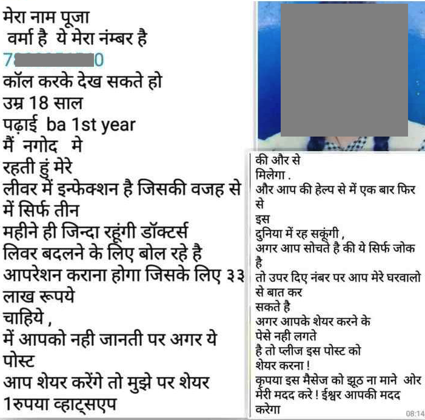

The documentary [TheSocialDilemma](https://twitter.com/hashtag/TheSocialDilemma?src=hashtag_click) emphasizes that financial incentives led 'fake news' and hate speech to proliferate on platforms such as Facebook and Twitter. But it falls short of explaining why the same are found on chat apps such as WhatsApp.

WhatsApp doesn't have an algorithmically modified feed, and no selective amplification by the platform. Yet, fake news goes viral on the platform. 

In this social media post for example in which a person claims that they will receive Rs. 1 from WhatsApp every time this message is forwarded:

The claim had its effect- it is clearly untrue. Yet the message was shared over 5000 times.

It was easy to pin financial motivations on Macedonian teens publishing [fake news on Facebook](https://nbcnews.to/3ltg4Zj). But what motivates people to create such content for chat apps such as WhatsApp? Virality is not directly profitable.

Anecdotal accounts would suggest that it is the self-satisfaction of seeing one's content go viral. In this specific post, the phone number might also be way of sourcing phone numbers from unsuspecting content viewers. But what is clear is that ideological and financial motivations don't explain all content on social media. More research/story-telling is needed to understand these varied motivations.
