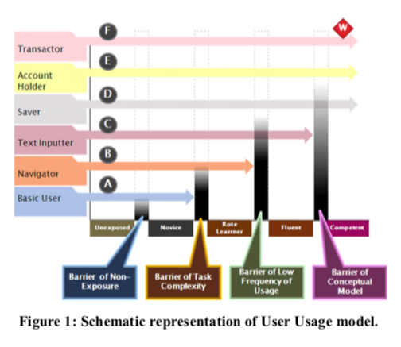
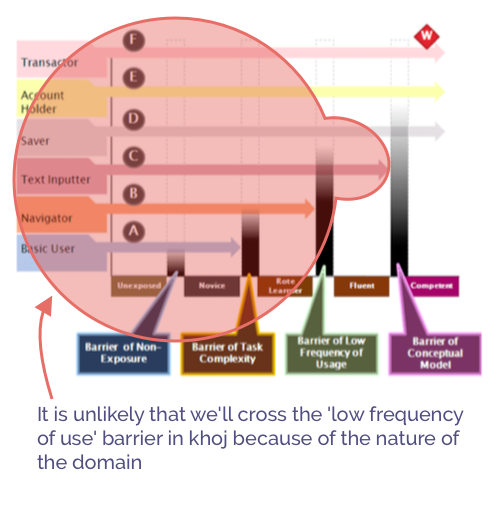

We are ready to roll out Khoj on smartphones as an Android app and a Whatsapp Helpline. We want to find smartphone users in the age range of 40-60 years to do a pilot with. The purpose of the pilot would be to answer questions like what their understanding of misinformation is, how can we help them so that they can participate in the content forwarding ecosystem without falling prey to misinformation unknowingly, how can we train them to be more active consumer and sharer of media and information etc. Our interest also lies in translating insights from this pilot into design and editorial interventions that can be used in Khoj and furthermore shared with others interested in curbing misinformation on their platform.

We reviewed the following two papers :

1. Technology adoption by ‘Emergent’ Users - The User-Usage Model by Devanuj and Anirudha Joshi ([link]( https://dl.acm.org/doi/abs/10.1145/2525194.2525209))
2. Making and Breaking the User-Usage Model : Whatsapp Adoption amongst emergent users in India by Devanuj Balkrishan, Anirudha Joshi et al ([link](https://dl.acm.org/doi/abs/10.1145/3014362.3014367))

The first paper proposes a model called the User-Usage model that captures the progress of a User’s usage of different features of an ICT artefact. This model is described as a way to model Emergent Users of ICT to distinguish them from Traditional Users who have had access to technology for a long time. Emergent Users are new users that have only recently begun accessing ICTs. Emergent users are also generally less educated, economically disadvantaged, geographically dispersed and culturally heterogeneous.

The second paper observes Whatsapp through the lens of the User-Usage model to show how design features of whatsapp have helped users overcome barriers and use complicated features of Whatsapp.

We started looking at this literature

1. To learn how to model users of the demographic we care for
2. To see if it will give us any insight on what kind of design related questions we should be trying to answer in the pilot

## User - Usage Model

The User - Usage model is a 2 dimension model of a User’s Usage of an ICT artefact.

The User dimension (Y-axis) categorises a user into archetypes based on factors like personal attributes such as attitudes, capabilities, culture etc. Some factors that the first paper identified were purchasing power, literacy, attitude towards ICT, proactivity, time availability, utility, age, aides, prevalence of ICT, trust on internet etc

The Usage dimension (X-axis) captures the different stages of usage of an ICT artifact by a user. The paper identifies the stages of usage as the unexposed, the novice, the rote learner, the fluent user and the competent user.

The formal definitions for these terms can be found in the paper. Though the terms are self explanatory, there is some nuance. For instance, a person is said to be unexposed to a given ICT artifact if they have not encountered it at all, encountered it but decided not to use it or have abandoned it after using it for a short period of time.

The blocks between each usage stage represents a barrier that prevents the user from progressing to the next stage. The four barriers identified in the paper are Lack of exposure to the artefact, Complexity of the task, low frequency of use, and lack of conceptual model of the artefact.

The researchers found that users who were on the same stage of Usage with an ICT artifact moved to the next stage in different time duration. The User dimension helps attribute the difference in progress of a user to their personal attributes. Which is what led the writers of the second paper to propose that since Users don’t get younger with time nor are they likely to become more educated, your design has to accommodate to help those users. It is our understanding that what is being proposed is that it is hard for people to move up the Y axis and the features you design should meet the user where they are to assist them in moving across the barriers.

## Relevance to our Pilot

1. Given the uniformity of our Pilot test demographic wrt age, economical status etc, we must identify which attributes about them matter when it comes to their ability to cross Usage barriers.
2. It will be easy to disregard our demographic’s ability to cross usage barriers using traditional features of a QnA app. It will be a challenge for us to leverage the skills that our users already have to design features that help them become critical consumers of information. One hypothesis that comes to mind from this paper is that given our focus on the demographic of 40-60 year old, some factors like frequency of usage might not change over time(partly because of the nature of khoj's purpose), in that case what features should we support to enable users to progress in their usage of our service.
3. The age demographic in the whatsapp adoption study is 18-50 years, which is only partially suitable for our purpose.
4. The second study observes that users have a high level of familiarity with forwarding content instead of typing text. We should incorporate this mental model in the messaging of our service. Instead of using phrases like ‘sending’, ‘uploading’ or ‘sharing’, maybe using ‘forward to...’ will work better with our users. This also reinforces the importance of creating shareable images as debunks in addition to textual information. This also ties into images receiving higher engagement than text.
5. Given the propensity of many users to simply forward content rather than generating it themselves. It does suggest the need for our service to provide them with shareable content instead. Maybe someday our service will enable some users to proudly say that they only share accurate information.
6. The second paper mentions how in some  ways,  WhatsApp acts as a passive entertainment device. For example, it states, “a homemaker hardly does anything on WhatsApp, except seeing images.” We have to consider features that let our service be used passively as well. One idea is to show a fact check of the day. But there is scope to come up with more engaging things. These passive features ensure the utility of the application is maintained and that the user frequently engages with the app. This in turn directly affects the user’s competency over time.
7. Users interviews in the second paper attribute a part of the complexity of apps to English. We should actively try to communicate with our users in the native language they prefer over English.
8. We found the Usage axis and barriers to be relevant to model our Users for the pilot. Additionally, we should identify tasks specific to misinformation and fact checking such as searching the web, asking an expert, reverse image search etc to understand the stage a user is in with respect to understanding the user’s progress.
9. Maybe a goal with the pilot would be conduct two week experiments where we offer various misinformation related services via the whatsapp number that require increased understanding of media, misinformation, tech literacy etc and see how exposure to the technology makes them jump from one barrier to the other. What nudges from our side make them jump barriers would be useful insight to incorporate in our products and also maybe share with a larger misinformation research community.
