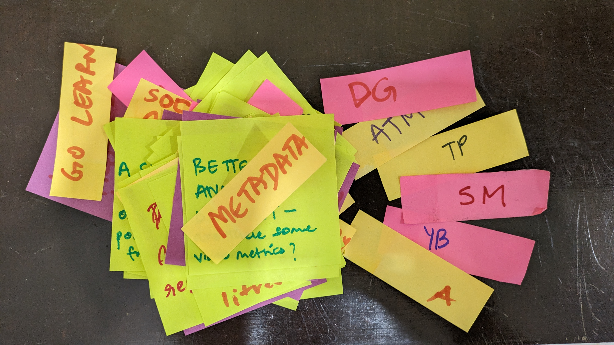
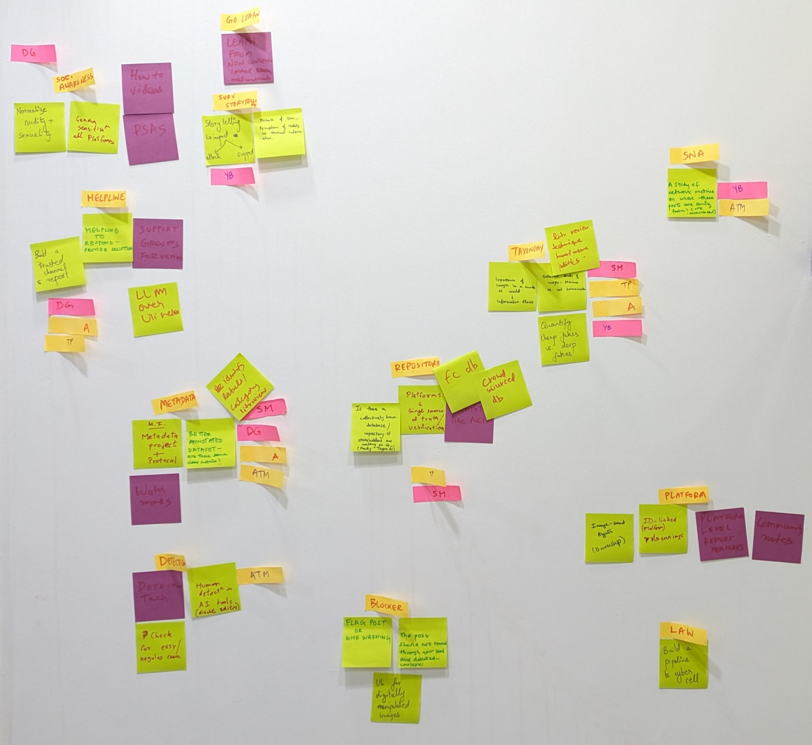

Over the last few months as generative image models gained popularity, they have made their way into consumer apps. The ease at which one can generate visuals has expanded the potential for expressing creativity. This also means that these tools are now adding to online harms that are propagated through images. Popularly known under names like deepfake, faceswap, lipsync, we call them by a much boring label - Digitaly Manipulated Media (DMM). 

Because of our prior work that focussed on images and videos for the study of misinformation, we've gotten queries from journalists, researchers and tech companies about various kinds of problematic visual content that has been surfacing off lately. We devoted our most recent in-person sprint to look at  DMMs as a special category within visual data and think about ways to mitigate harms caused by them. This included technical methods for detection as well as civic and regulatory approaches. 

I facilitated a 4 day Design Sprint to come up with a possible one-year roadmap on the Problem Statement " How can Tattle increase civic agency against Digitally Manipulated Media"

The 4 days were roughly split under the theme IDEATE, PROTOTYPE, BUILD, DEMO

Two days before the sprint began we shared a non-intense reading list with the team. Since this is a topic that would have required expertise in multiple domains and we have a multi-disciplinary team, we hoped it would help providing a shared understanding of terminology and lanscape.

A subset of them are : 
* https://www.nytimes.com/2023/03/12/technology/deepfakes-cheapfakes-videos-ai.html
* https://datasociety.net/library/deepfakes-and-cheap-fakes/
* https://arxiv.org/abs/2304.01328
* https://www.boomlive.in/decode/x-is-full-of-deepfake-porn-videos-of-indian-actresses-kajol-deepika-padukone-23533
* https://www.boomlive.in/law/elections-pornography-laws-on-technology-deepfake-artificial-intelligence-23656

## Day 1 : Ideation

We did  a braindump of the team's response to the problem statement. We discussed each of their ideas in detail and tried to identify the ones that were similar. 

By the end of the day we had clusters of similar ideas:

The major clusters that we identified where - Metadata, Taxonomy,  Repository, Detection, Blockers, Platform, Law, Social Awareness, Helpline, Storytelling. Explanation about each can be read on our post sprint documentation (add link)

We had two goals for the end of the day : 

1. Think through ideas to have enough to formulate a multi month strategy

2. Finalize some thing we could build/work on collectively for the duration of the sprint.

To address (2) we had everyone vote on the three clusters they'd like to work on that week. The 'Metadata' and 'Taxonomy' clusters emerged as victorious. This was most likely because those were the clusters where we could make some progress on with the talent we had in that room and didn't require external help.

## Day 2: Prototyping

We set aside this day to rule out all the unknowns: What datasets are available relevant to our use case, what kind of datasets would we have to make, and if we were going to make it what would be the possible ready made data sources etc.

Some of the work that happened on day 2 included: 

1. Finding news reports about DMMs in India to see what kind of information is available about techniques used, the nature of forgery etc
2. Finding forums dedicated to Indian deepfakes
3. Looking through fact check stories about image manipulation. We also did a prototype of getting data from Google's claims review API client to see if there was a way to programatically search for stories about DMMs on fact check sites
4. Downloading datasets relevant to DMM detection. We got access to one such public dataset and found some that required signing licesne agreement with the authors.

## Day 3: Build
We deprioritized pornographic deepfakes for our focus and instead focussed on other categories of DMMs to create a dataset of such cases in India. We tried to find the original media associated with the manipulated media. We also tried to annotate certain fields identified by the Taxonomy and Metadata team to see how dificult or easy it was.

That dataset with some sensitive columns removed can be found [here](https://docs.google.com/spreadsheets/d/1zPkhJLuKMeiry6UfWXR6PYcnL1wtE9IVxnqn_7tN5J4/edit#gid=0)

## Day 4: Demo  
We shared our work with Gurpreet Luthra at Thoughtworks who has been mentoring us, to figure out the best way to proceed from this one design sprint. A strategic question we had was "How to start new work in DMM, which is still experimental, without disrupting our current roadmap?"
