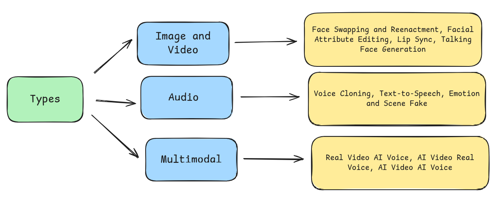

Generative AI models are increasingly used in creating synthetic media, including deepfakes and doing media manipulation. Their application ranges from creating innocuous memes to misleading and false media. Fact-checkers and organizations working to detect and combat such content often publish [detailed reports](https://www.dau.mcaindia.in/blog/videos-of-mukesh-ambani-arnab-goswami-promoting-financial-investment-projects-are-fake) outlining the tools and methods used to identify deepfakes and media manipulation in video/audio. They use a range of automated AI tools, both proprietary and open-source. 

We wanted to gain a better understanding of the performance of open-source tools and machine learning models used for detecting deepfakes and AI-generated content. Doing so allows us to compare their results with proprietary tools and services, giving a useful baseline for evaluation of paid services. Additionally, there are various detection techniques, models, and tools used to identify synthetic content in video, image, and audio. Analyzing open-source tools will also help us understand the type of techniques/models available for deepfake detection. Various models differ in their pre-training data, model architecture and the features they prioritize; we wanted to see if it's possible to find correlations between model performance and the type of manipulation it can detect. We were also trying to understand how easy it is to set up and run the FOSS models. What frameworks, libraries, and tools are commonly used in training/inferencing these models? Do the model developers provide containerization options, such as Dockerfile? etc

For our initial exploration and literature review, we began by identifying open-source projects focused on deepfake detection. We chose to look at the [Deepfake-o-Meter](https://zinc.cse.buffalo.edu/ubmdfl/deep-o-meter/landing_page) project from the University of Buffalo. It is an open platform that integrates state-of-the-art methods for AI generated image, video and audio detection, supporting 18 models across various modalities [^1]. We also chose it because it is an active platform, and more likely to have the best-performing models. The authors compare Deepfake-o-Meter with other commercial and open-source projects like Deepware, WeVerify, DuckDuckGoose, and Sensity, while also reporting its usage statistics.  
We used this project to get an idea of the norms present in open source ML models for deepfake detection. 

We document each model's details, including its underlying architecture, training dataset, experiment setup, results, some important conclusions, and shortcomings of the models, in this GitHub issue: [https://github.com/tattle-made/deepfake-marker/issues/2](https://github.com/tattle-made/deepfake-marker/issues/2)

Alongside this, we also looked at the different types of deepfakes across various modalities and have categorized them in the figure below. This breakdown highlights the key forms of manipulation within image, video, audio, and multimodal deepfakes, which further gives us insights into their diverse applications.[^1][^2][^3]

As we wanted to assess feasibility, in terms of training/inference and the potential for self-hosting. We did a high level categorisation of all the models in deepfake-o-meter based on attributes such as framework/library used, programming language, and ease of use (<u>easy</u> \- instructions to run the model are given and weights are open, <u>medium</u> \- model needs to be trained, <u>hard</u> \-  model needs to be trained or/and training instruction are vague/not available).

| Model Name | Framework/Library | Language | Ease of use | Modality |
| :---- | :---- | :---- | :---- | :---- |
| [Nodown](https://github.com/grip-unina/GANimageDetection) | Torch | Python | Easy | Image |
| [GLFF](https://github.com/littlejuyan/FusingGlobalandLocal) | Torch | Python | Medium | Image |
| [DMimageDetection](https://github.com/grip-unina/DMimageDetection) | Torch | Python | Hard | Image |
| [CLIP-ViT](https://github.com/Yuheng-Li/UniversalFakeDetect) | Torch | Python | Easy | Image |
| [DSP-FWA](https://github.com/yuezunli/DSP-FWA) | Torch | Python | Easy | Video |
| [LIPINC](https://github.com/skrantidatta/LIPINC) | Tensorflow, OpenCV | Python | Easy | Video |
| [LSDA](https://github.com/SCLBD/DeepfakeBench/tree/main) | Torch | Python | Easy \+ Dockerfile Given | Video |
| [RawNet2](https://github.com/eurecom-asp/rawnet2-antispoofing) | Torch | Python | Hard | Audio |
| [RawNet2-Vocoder](https://github.com/csun22/Synthetic-Voice-Detection-Vocoder-Artifacts) | Torch | Python | Easy | Audio |
| [Whisper](https://github.com/piotrkawa/deepfake-whisper-features) | Torch, openai-whisper | Python | Easy | Audio |

(A more detailed extension of this table can be [found here](https://github.com/tattle-made/deepfake-marker/issues/2#issuecomment-2601652610))

### Some Takeaways
Of the 18 models in deepfake-o-meter, 6 were for image, 7 for video and 5 for audio. 

* Most image and video models only support detection of facial attributes based manipulation  
  * The image-based models were trained on synthetically generated datasets and focused on detecting GAN-generated images (please refer to the Appendix below for details about GANs).  
  * Each model approached the problem differently, using different methods/techniques. Some focused on analyzing image features, while others used an ensemble of models with a thorough pre-processing pipeline. GANs leave detectable fingerprints in generated images, these are some Spatial and Frequency domain features left in an image, which help detect whether an image was created/manipulated using GANs.   
  * To detect deepfakes in images, one model used a vision transformer instead of a CNN and took a different approach by proposing a classification method that does not explicitly train a network to distinguish real from fake. (see appendix below)  
  * Video-based models use CNN’s to detect spatial artifacts like facial wrapping, blurring or missing facial details. Other approaches analyze temporal features in videos, such as facial expressions and lip-syncing, using CNN- or transformer-based methods.  
* Models still face challenges in detecting low-resolution manipulations or previously unseen real-world images.   
* Audio-based models are trained on good quality controlled datasets and failed to perform well on real world examples.  
  * A common approach is to convert the audio waveform into a spectrogram and perform supervised classification on the resulting image. To enhance robustness, extensive pre-processing (e.g., MFCC extraction, sampling) and post-processing (e.g., adding noise) are also applied.

### Appendix

* <u>Convolutional Neural Networks (CNNs)</u>: Are a type of machine learning models that are commonly used in computer vision problems like image recognition. The underlying architecture is a [neural network](https://en.wikipedia.org/wiki/Neural_network_\(machine_learning\)). CNNs overtime showed solid performance in understanding and interpreting image or visual data. ([detailed virtualization of a CNN](https://www.youtube.com/watch?v=aircAruvnKk), [interactive guide to the basics of neural network](https://jalammar.github.io/visual-interactive-guide-basics-neural-networks/))  
* <u>Generative adversarial networks (GANs)</u>: Are a type of machine learning models that can generate data (e.g. images or text). They autonomously learn patterns in the input data to generate new examples resembling the original dataset. For example, GANs can create images that look like photographs of human faces, even though the faces don't belong to any real person. ([more information on GANs](https://developers.google.com/machine-learning/gan))  
* <u>Vision Transformer</u>: It is a model for image classification that uses the Transformer-like architecture over patches of an image. Transformer is a neural network architecture used for performing machine learning tasks particularly in natural language processing (NLP) and computer vision. It has the ability to understand context over large amounts of data. ([simple breakdown of transformer architecture](https://jalammar.github.io/illustrated-transformer/), [tech explanation of vision transformer](https://huggingface.co/docs/transformers/en/model_doc/vit)) 

[^1]: DeepFake-O-Meter v2.0: An Open Platform for DeepFake Detection, https://arxiv.org/abs/2404.13146
[^2]: Deepfake Generation and Detection: A Benchmark and Survey, https://arxiv.org/abs/2403.17881
[^3]: Hindi audio-video-Deepfake (HAV-DF): A Hindi language-based Audio-video Deepfake Dataset, https://arxiv.org/abs/2411.15457