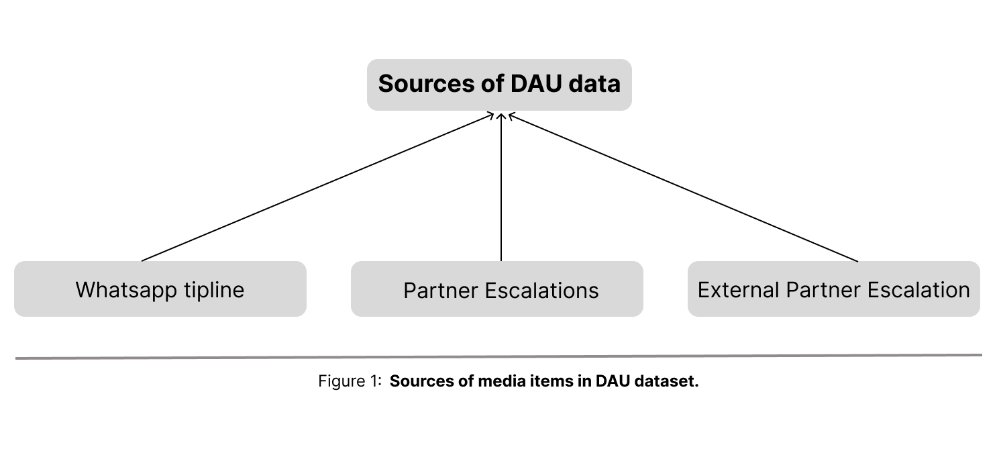

## What is the DAU

The DAU's (Deepfakes Analysis Unit) mission is to generate awareness on algorithm-based manipulation of media content. Through its tipline and partnerships, it aims to enable users to combat generative AI-based fabrication. This endeavor is a collaborative venture involving journalists, academics, and companies, pooling efforts to confront the escalating threat of deepfakes.

## Work Done by Tattle
The project involved multiple stages of research and technical implementation.

1. **Qualitative researcher :-** Data analysis documentation, understand how to ethically release this dataset, collect information about the original data, how it was described, and how it is categorized.

    a. **Interviews :-** Tattle interviewed people who may want to use this dataset to understand why and how they would like to use it after release.

    b. **Data Analysis :-** Tattle identified the sources of the data to understand what type of information each field contains and identify-gaps and repetition in the data.

2. **Tech Implementation :-**  Tattle Tattle analyzed the data, organized it into structured tables, and designed the UI to define how the data would be displayed to users.

---

## Purpose

1. The purpose of this project is that fact checking queries of the dataset allow the public to study and analyze misinformation.     
2. For researchers interested in studying AI manipulation in media, this dataset can help analyse trends in news themes, types of bias observed, degree of accuracy etc.

---

## Why

Tattle’s work is to reduce harmful content online and minimize misinformation as much as possible.
We build  tools and  datasets to understand and respond to inaccurate and harmful content. DAU is one such tool to detect AI manipulation in online audiovisual content.

---

## Challenges

1. Bringing data from multiple sources into a single structured dataset was challenging because of the metadata field between the sources.  
2. Difficult to detect AI manipulation in some data as AI detection tools can give contradictory results.

---

## Result

As a result of this work, the DAU dataset has been structured and documented for public release, making it easier to study misinformation" I think you should change that part to "making it easier for researchers and journalists to study the ways AI tools are used to manipulate audio and video, and how deepfakes are generated and circulated.
