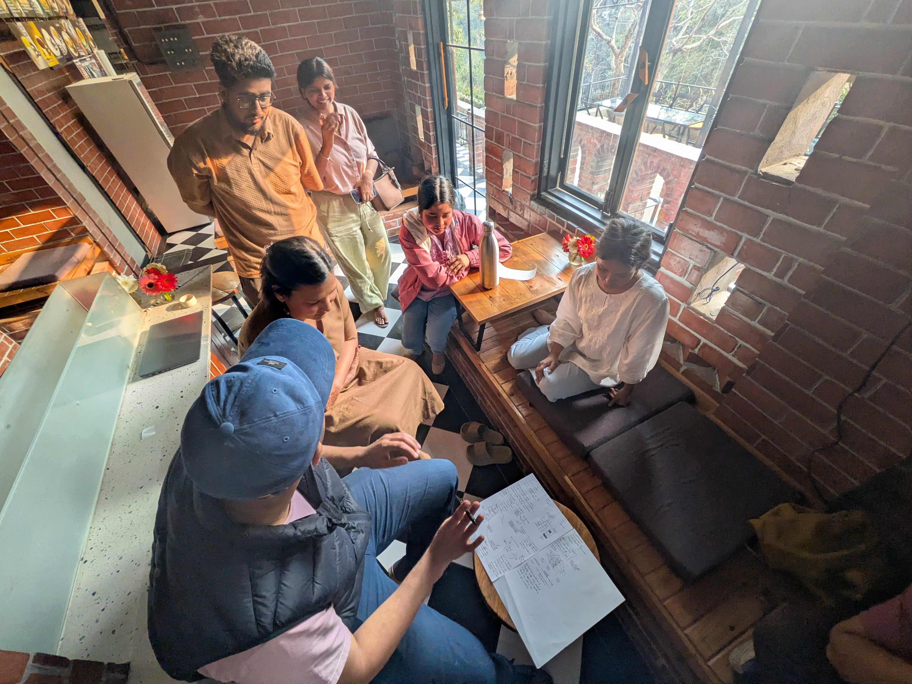
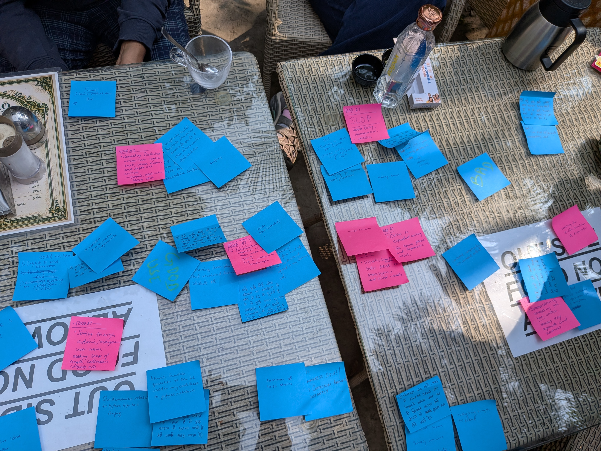

## Drafting Tattle’s AI Policy

In January of this year, I threw a spontaneous poll to the Tattle team to understand their approach to AI. The options were:

* We shouldn’t use AI at all  
* I am curious but cautious  
* I want to try as many tools as possible

In true Tattle egalitarian spirit, every option got at least one vote. It was clear that we were going to have differences in opinion on the use of AI in our work. It was also clear that we needed to draft an organization-wide AI use policy.

In February, we met in person in Rishikesh. The one outcome we had set for the short sprint was to have Tatte’s AI use policy that could guide the team. As a way to get the different team members to see where other team members might be coming from we did the following:

1. Read papers exemplifying the different perspectives and then discuss it. 

   I picked [Attention is All you need](https://arxiv.org/abs/1706.03762) and [Stochastic Parrots](https://dl.acm.org/doi/epdf/10.1145/3442188.3445922) as two papers we should read. By AI timeline standards, these papers are old but still relevant. Baarish also suggested the paper on [African Data Ethics](https://dl.acm.org/doi/10.1145/3715275.3732023) but we couldn’t cover it in the discussion.  
   The Tattle team is heavily cross-disciplinary. We hoped that reading these papers would help people understand the different perspectives on AI. But, the papers weren’t equally accessible to everyone. So, a few people in the team summarized each paper for the others. Denny summarized the Attention is all You Need paper in Hindi. We can say he passed Feynman’s test of explaining things to a first year student with flying colors.   
     
     
     
2. A demo where people using AI could show how they were using it   
   Here Kritika and I demoed how we use it in coding. Preeti and Manisha described how they use it in translation and drafting. For someone of my skill level- who gets the pseudocode but doesn’t code frequently enough to remember syntax- Claude code has been supremely useful. Kritika, as a full time engineer, uses it in her regular workflow through an IDE.

3. Two mapping exercises:  
   1. What we had found AI to be good and bad at.  
      Through this exercise we could spot some high level categories/ buckets of AI use such as coding, writing and translations that people found AI useful for.  
       
      

   2. What we thought AI should and should not be used for.   
      Even if AI is good at something, it doesn't mean that it should be used for the task. Instead of having a philosophical discussion on AI, I thought it would be more productive to list the specific use cases that people supported or opposed the use of AI in. Here we didn’t restrict ourselves to possible use cases at Tattle. People were free to list any use of AI. Here are some examples that the team categorized in the two buckets. There were some use cases that one person had listed in a ‘should use’ bucket, and another in the ‘should not’ bucket.   
      

 ## Should Use:

* Finding and doing administrative and government work  
* Getting useful information such as helplines, shelter homes, safety areas on speed dial.  
* Getting started on a skill  
* Use it to improve personal productivity such finding/ comparing deals and helping with time management  
* Transcription  
* Developing schedules and plans: PA work  
* Introduction/ discovery into a new field  
* Assisting doctors in prescriptions, note taking  
* Difficult, cutting edge research domains such as medical research  
* Prototyping/ testing new ideas

  ## Should Not Use:

* Customer service  
* Doctoring images  
* Surveillance: WFH, facial recognition, tracing geographical data, private identity based data collection  
* Therapy, conflict resolution and critical interpersonal communication  
* Critical professional or personal decision making  
* Writing research papers  
* Upload personal data on free accounts  
* Create apps that alter images for artistic or deceptive purposes.  
* create images and graphics to become a part of trends on social media  
* Don’t ask random information on the go.  
* Qualitative data labeling, analysis

  

  We held a discussion on why we had listed a task as a permissible AI use case vs. not. A pattern I saw was that people were more protective of their own expertise and had strong opinions of when not to use AI in it. But they were more comfortable stating that it should be used for tasks outside their expertise. 

	Through this discussion we were also able to identify some common intuitions that served as guiding principles for the policy. 

After three days of reading, deliberations and discussions- with some (not complete) consensus on acceptable and non-acceptable uses of AI- we were in a good place to start writing the policy. We divided the team of 9 into three groups- each focused on a different use case. As a general guideline I asked people to think about red lines, disclosures and best practices. Each group interpreted the guideline differently and wrote the policy for their use case in their voice. I think the distinct personal voice of each section adds to the policy being functional.   
Each subgroup shared their draft with others in the team. People reviewed the other sections, left comments which were incorporated by the authors. A week after we started, we had our first AI policy. You can read it [here](https://tattle.co.in/blog/2026-03-16-Tattle-AI-Policy/). 

AI is rapidly evolving, and we recognize that we will need to come back to the policy and revisit some assumptions and update it. But for now, this is a helpful guide. I confidently made my first Javascript commit to the Tattle code base (thanks Claude) to add the AI policy with collapsible sections, to the Tattle blog. As the policy stated, I wrote my PR ‘by hand’.
