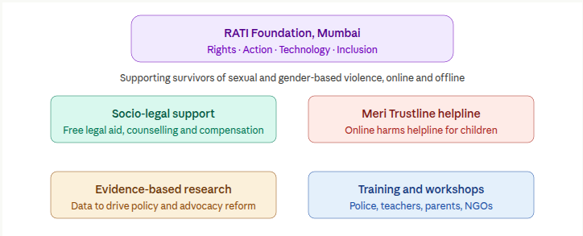
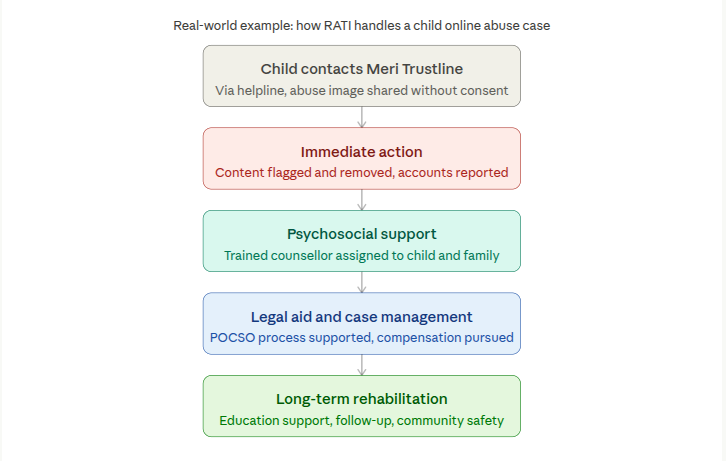
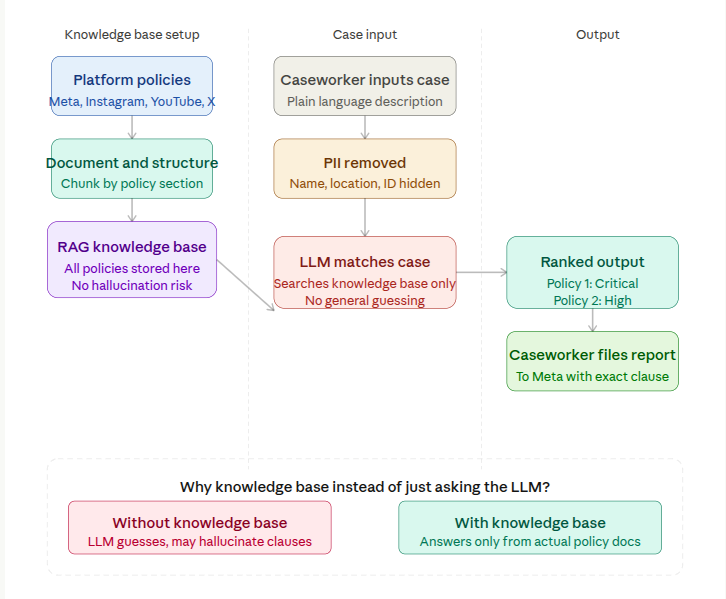

## Introduction 

The [RATI](https://ratifoundation.org/#about-us) (Rights. Action. Technology. Inclusion.) Foundation is based out of Mumbai and works to address the issue of violence against children & women both in onground & online spaces. It does this through a wide range of strategies which include providing on-ground victim support, building of networks, strengthening of civil society organizations and government systems, implementing tech solutions, conducting evidence-based research, developing accessible resources and training of stakeholders. 

## How RATI Responds to a Case
Say a 14-year-old's intimate image is being shared non-consensually online, a situation that is far more common than it should be. RATI's response is end-to-end.
The child or a trusted adult reaches Meri Trustline, RATI's helpline. RATI immediately contacts the platform to remove the content and report the account. A counsellor is assigned for psychosocial support and comprehensive rehabilitation support to both the child and family. Their legal team supports the family through the POCSO process and pursues compensation. And long-term follow-up ensures the child gets back to education and community safety. (For more on Rati’s process see: https://aarambhindia.org/about/)

It is a thorough, human-centred process and RATI would like it to be so. They are interested in identifying bottlenecks that can be elimiated.

## Problem
When a child safety caseworker at an organisation like RATI Foundation receives a report, say, of a 14-year-old's intimate image being shared without consent on Instagram, the first practical question is: which platform policy has been violated, and which is the most critical one to invoke?
Today, answering that question is entirely manual. A caseworker has to navigate the content policies of Meta, Instagram, YouTube, and X simultaneously. These documents run into hundreds of pages, are updated frequently, and are written in legal language that is hard to parse under pressure. Identifying the right reporting pathway can take days. For a child waiting for content to come down, that is too long.
Tattle is working with RATI Foundation to explore whether an LLM, given structured knowledge of platform policies as context, can reliably identify which policies apply to a given case and rank them by severity, reducing the intake process from days to minutes.

## Objective
To identify all platform policies violated in a given child safety case, cite the exact policy section, rank violations from most to least severe, and return output that is usable by a non-technical frontline worker without further legal interpretation.

## Our Approach
We collected publicly available content policies from major platforms: Meta Community Standards, Instagram Community Guidelines, YouTube Community Guidelines, and X Rules. These were structured by topic section and loaded into the LLM as additional context, rather than embedded in a vector database. This keeps the retrieval transparent: caseworkers can see exactly which policy text the model is drawing on.
A caseworker inputs a short case description in plain language. No legal training required. The model then cross-references the case against the knowledge base, identifies every policy that applies, and returns a ranked list, most critical violation at the top, with a reason and the relevant policy clause attached to each.
For example, a case involving a 14-year-old's non-consensual intimate image on Instagram returns a ranked output where Meta's Child Sexual Exploitation and Abuse policy appears at rank one marked as critical, followed by their Non-Consensual Intimate Images policy at rank two, followed by Bullying and Harassment at rank three. A caseworker can use this output directly to file platform reports, support the POCSO process, or hand documentation to a legal team.

| Rank | Policy Violated | Platform | Severity  |
|:----| :--------------------- | :-------------- | :-------------- |
| 1 | Child Sexual Exploitation & Abuse (CSEA) Policy | Meta / Instagram | Critical |
| 2 | Non-Consensual Intimate Images Policy | Meta / Instagram | High |
| 3 | Bullying & Harassment Policy | Meta / Instagram | Medium |

***The diagram below shows how the RAG knowledge base pipeline works end-to-end.***

## Impact
The policy research work that used to take an experienced counsellor hours, and a new counsellor potentially days, now takes minutes. A caseworker who has never opened a Meta policy document can input a case and immediately know which policy is violated and which clause to cite in the report.
This matters most for new counsellors joining RATI's team. The knowledge that currently lives only in the heads of senior caseworkers is now accessible to everyone through the knowledge base.

## Challenges
Platform policies change regularly. We are working on building an auto-update system so that whenever a platform revises its guidelines, the knowledge base updates itself automatically. This is currently in development.
Severity ratings need human calibration. We are continuously working on improving how the model responds, adding new features, and making the ranking more accurate based on feedback from RATI's caseworkers and legal experts. This work is ongoing.

