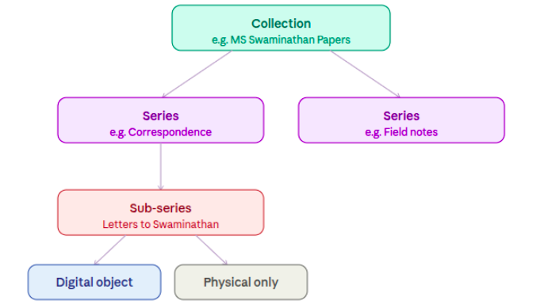
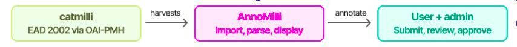

### What is AnnoMilli?
Imagine you are browsing a digitised archive and come across a photograph from 1968. You recognise the face and know the story behind it. But the catalogue record only says: “photograph, undated.” There is nowhere to add what you know.
AnnoMilli was built for exactly that moment.
AnnoMilli (pronounced like “anomaly”) is a prototype annotation platform for archival catalogues. It allows people to add knowledge, context, and personal responses to individual files within an archival collection through a structured, admin-reviewed workflow. Users can contribute descriptions, subject tags, name references, and emotional reactions to historical material. 

*In other words: AnnoMilli is the tool that sits next to an archive and says: "you know something about this file that the record does not say yet. Add it here."*

### NCBS and its Archives
The National Centre for Biological Sciences (NCBS) in Bangalore is one of India's foremost biological research institutions, operating under the Tata Institute of Fundamental Research. Inside the same campus sits something less obvious: the Archives at NCBS, a public centre for the history of science in India.
The Archives holds over 350,000 processed objects across 50+ collections. Letters, field notebooks, photographs, audio recordings, scientific equipment, and lab notes spanning more than a hundred years of scientific work in India. Collections include the papers of ornithologist Ravi Sankaran, molecular biologist Obaid Siddiqi, agricultural scientist MS Swaminathan, rocket scientist TSG Sastry, and early 20th-century agricultural scientist Leslie Coleman. (https://www.ncbs.res.in/about-us)

The work of keeping and organising all of this belongs to what the field calls archival practice. The job is not just to store things. It is to organise them into a navigable structure so that whatever someone needs, they can actually find it.

**MS Swaminathan Papers**
Over 48,000 objects spanning 80+ years of work: correspondence, field notes, photographs, and administrative documents from the scientist who led India's Green Revolution. All organised, catalogued, and held at the Archives at NCBS.

### The hierarchy: from collection to file
Every archive follows a structure. At the top is a collection, everything related to one person, institution, or subject. Inside that, material is grouped into series (broad categories like "correspondence" or "field notes"), then sub-series, then individual files. Some files have a digital object attached: a scanned image, an audio file, a video. Others exist only physically. The archive tracks both.
Think of it like this. Say NCBS has collected decades of material related to a scientist. Everything goes into one collection named after them. Their letters are one series. Their published papers are another. Their photographs are a third. Within the letters series, letters to specific people become sub-series. Each individual letter is a file. Some files have been digitised; others are still only paper in a box.

Every archival object has a precise address in this hierarchy, both physically (which box, which shelf) and digitally (which collection, which file).
Without this structure, you would have thousands of items in a box with no way to know what is there or find what you need. The hierarchy is what makes an archive searchable. It is the map of the collection.

**Leslie Coleman was an early 20th-century agricultural scientist in Mysore state.**
His collection at NCBS Archives is organised as: Leslie Coleman Papers (collection) > Correspondence (series) > Letters from field officers (sub-series) > individual letters (files), some digitised as scanned images, others still only paper.

### EAD and OAI-PMH: the machinery behind archival catalogues
In the digital world, an archive's structure is encoded in a format called EAD, Encoded Archival Description. An EAD file is an XML document that captures the full hierarchy of a collection: which series it contains, which sub-series, which files, and what metadata each carries. It is the digital version of the map.
To make these maps shareable across institutions, archives publish them through OAI-PMH, the Open Archives Initiative Protocol for Metadata Harvesting. It is a standard protocol that lets one system say to another: here are my catalogue records, take what you need. Catalogue aggregators use this to harvest EAD files from multiple archives and bring them into one searchable place.
For this prototype: Catmilli, an ArchivesSpace instance, acts as an aggregator that hosts many EADs and serves as an OAI-PMH-compliant EAD 2002 disseminator. Anno-Milli can import one of these EADs from Catmilli. It holds the catalogues from the Archives at NCBS along with a select few open OAI endpoints that disseminate EAD 2002 catalogues. On catmilli, folder-level archival objects carry an "anno.milli" action button that takes the user directly to annotate that object on AnnoMilli.

### The AnnoMilli workflow
AnnoMilli is built to work with a catalogue aggregator that disseminates EAD 2002 XML files over OAI-PMH. The workflow moves in three phases: harvest, parse, annotate.

catmilli exposes EAD files over OAI-PMH. AnnoMilli harvests and parses them. Users annotate; admins approve.

Once ingested, a user can navigate the full collection structure from catmilli and reach any file-level object. From there, they submit an annotation.

**Four ways to annotate a file**
AnnoMilli offers four types of annotations. Three go through admin review before appearing on the record. One, the emotion annotation, is instant.

| Description | Subject | Peoples, places, organisations | Emotion  |
| :--------------------- | :-------------- | :-------------- | :----------- |
| Free text. Write what is in the file, who it is about, or any context the catalogue record does not carry. | Select from a dropdown of LCSH subject headings, or add a new subject not in the list. | Select from the LCNAF name authority list, or add a new name that does not appear in the dropdown. | Choose from a toggle list of eight emotion responses. How did the material make you feel as a reader? |
| **Admin review required** | **Admin review required** | **Admin review required** | **Displayed immediately**
 |

Once an annotation is approved, it appears in the "Annotations for this file" section on the object's record page. Emotion annotations skip the review queue entirely and display immediately. They are responses, not factual claims, and carry a different epistemic weight.

### Why we built this
Tattle is a civic tech organisation. We build open-source tools to understand and respond to misinformation in India. So what were we doing building archival software?
We had already spent time thinking hard about the difficult questions that come with community annotation: who gets to annotate, whose knowledge counts as valid, how you handle contested or ambiguous interpretations, how an admin workflow maintains quality without becoming a gatekeeping problem.
We were also genuinely curious about how archival systems work as information infrastructure: the EAD format, OAI-PMH as a dissemination protocol, the gap between physical organisation and digital representation. These are interesting technical problems, and they sit at the intersection of open knowledge, community curation, and civic technology.

*The collaboration: We built AnnoMilli together with the Archives at NCBS. They brought deep knowledge of archival practice and the collections, and we brought annotation workflow design, open-source tooling, and experience with community-driven data projects. The result is a prototype that neither of us would have built alone.*

### A prototype that holds up -  and an open question
What this prototype proves is that the workflow is viable. The technical pieces fit together. The four annotation types cover meaningfully different kinds of knowledge. The Milli Local Knowledge classification is a small but important acknowledgment that community knowledge does not always map onto existing authority lists. And the single button on a catmilli catalogue record that takes you directly to annotate that object is the kind of design choice that makes a tool feel real rather than theoretical.
The problem AnnoMilli addresses is worth discussing publicly: how do you attach community knowledge to archival material, at scale, with quality control? If you work with archives, build archival software, or think about annotation as an infrastructure problem, we would like to hear from you.

