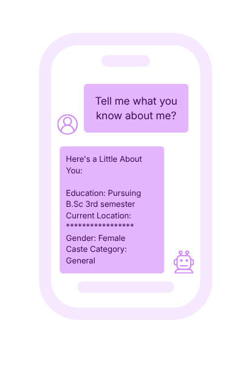
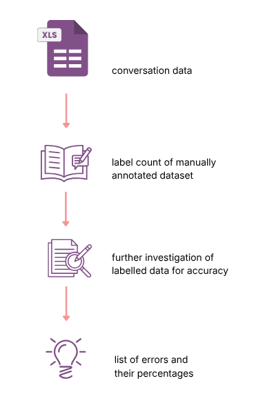
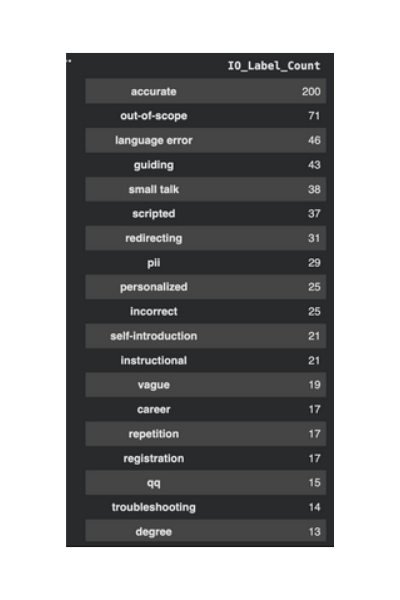

Companies are keen on deploying AI solutions for their users. There's a rush to get to market first. While practices of UX design and security have matured for digital products, AI safety is still a burgeoning domain and practice. Over the last year Tattle has had the opportunity to conceptualize and implement a strategy for implementing AI safety. In this article, I present Tattle’s approach to conducting manual evaluations of AI tools to identify risks and harms emerging in different domains in the Indian social sector. These manual evaluations became the foundational research guiding the development of safety guardrails aimed at specific harms that could be used and adapted to domain by any nonprofit. I detail the process of our evaluations, share critical observations from our research, and outline a practical guide on how to replicate our methodology and adapt it to other AI deployments in the social sector. 

## Context

Tattle’s work with AI safety has followed in a continuum from our long term project on combatting [TfGBV Uli](http://uli.tattle.co.in). Following the publication of the crowdsourced slur list of harmful words in 6 Indian languages, aka the [Uli Slur List](https://uli.tattle.co.in/uli-for-ts/), Tattle worked with [MLCommons](https://tattle.co.in/products/ml-commons-safety-benchmark/) to produce an AI safety benchmark dataset for hate crimes and sex related crimes in Hindi. This work then led to our collaboration with Project Tech4Dev aimed at providing training in understanding AI safety and building safety guardrails for the AI deployments of several nonprofits in their [AI Cohort Program.](https://projecttech4dev.org/learnings-from-the-ai-cohort-program/) As AI safety partners our mandate was to conduct research on the pilot deployments of select nonprofit’s AI tools to understand emerging safety risks, conduct knowledge building sessions on the basics of AI safety and evaluations, and build safety guardrails that can be used across multiple nonprofit domains based on the outcomes of our qualitative evaluations. 

## Research Background 

The fundamental choice in evaluation methodology often comes down to two distinct approaches: human evaluations and automated evaluations. Both approaches have strengths and weaknesses, and we argue a balanced mix of both is necessary to ensure continuous rigorous testing of AI tools. To briefly describe what each approach can do I list their definitions with some advantages and disadvantages below: 

|  | Human Evals | Automated Evals  |
| :---- | :---- | :---- |
| **Description** | Involves researchers and domain experts evaluating LLM responses to determine accuracy and develop evaluation criteria. | Uses advanced LLM models like GPT or Claude to evaluate responses based on predefined or human defined criteria.  |
| **Pros** | Nuanced analysis   Adaptive to multilingual context  Catch edge cases | Speed  Scalability  Cost effectiveness |
| **Cons** | Expensive  Time consuming to scale Human error/bias  | Probabilistic accuracy  Hallucinations Off the shelf models reflect bias of designers/training data |
| **When to use** | Multilingual and Multicultural contexts High risk use cases  | Limited functionality e.g. customer service chatbot that answers only a fixed set of questions.  Scaling up with rigorous evaluations.  Low risk use case.  |

## Research Methods and Data Collection 

Tattle has developed a four-step process for conducting human evaluations of LLM systems. This was tested and iterated on by analysing data from 3 AI deployments by nonprofits in the health and education sectors. We received data from all three chatbots’ pilot runs under an NDA and then conducted a thorough analysis on small samples of data taken from each dataset. The pilot run of these AI deployments occurred during early to mid 2025, and our research/analysis was conducted between October 2025 and January 2026\. 

The data analysis would be used to determine the types of safety guardrails Tattle would develop for the AI cohort program and make available more broadly for any social sector organization. The analysis and recommendations had to be prepared within the timeframe of 4-6 weeks to account for research and development of the guardrails in the next phase of the project. Based on the analysis from these evaluations, we aimed to develop custom solutions for the most pressing risks observed in the dataset. As the project progressed we configured the custom solutions to be adaptable to nonprofits across different sectors and provided recommendations for how to make them relevant to certain use cases. 

The four steps of our AI valuation process are elaborated below. 

### Step 1: Manual Sampling

The size of each dataset that we received from the nonprofits varied from 75000 pairs of input- output conversational segments from NGO to a live sheet consisting of 500+ unique conversational flows from another nonprofit. In order to select a sample that was representative and meaningful for analysis we had to consider a few things. 

1) Selecting data points scattered across the time period during which the pilot data was collected. A note on the sample, since the bots we were evaluating were still in their experimental phase, the sample over represented data from the most recent two months. This was because in the earlier phase of the pilot, there were very few multi-turn conversational flows.   
2) Ensuring the size of the sample was manageable for individual evaluators to annotate thoroughly within the time frame required by the client varying from 1-3 weeks.   
3) Focus on discovering edge cases and understanding the conversational context rather than scalability of analysis to provide bespoke recommendations to the client. 

Based on these considerations two researchers selected sample data using a manual random sampling approach for selecting data. In practice this meant selecting about 5-6 conversational pairs at regular intervals in the dataset. We aimed to get about 1.5% of the larger dataset as a sample; 1000 out of 75000 input-output pairs. For the second dataset we selected 500 out of 20000 input-output pairs. About 2.5% of the pilot dataset. 

### Step 2: Annotating

Once we had the sample curated, we decided to annotate the dataset in two ways. First, we focused on labeling only the input messages to identify user intent. For this we drew lessons from [NOORA health’s User Intent classification framework](https://noorahealth.github.io/LLM-Project-doc-site/docs/Intent%20Recognition%20System/Overview/Future%20State). While NOORA uses user intent classification to reduce load on their Medical assistance, their classification was helpful as a starting point to identify types of messages users were sending to the NGO’s chatbots. Building on this, we decided to expand the classification to include thematic topics of user queries, in/out of scope queries, high-risk inputs on themes flagged by the client, and auto-generated inputs based on menu options the LLM provided. 

* Query \- subcategories with themes based on client use case  
* Greeting   
* Acknowledgement   
* Auto-generated   
* Spam  
* High-risk   
* Out-of-scope

The second type of annotation involved labeling the input-output pair to identify accuracy of LLM responses, types of automated responses, errors identified such as vague response, harmful, risky, or nonsensical, and whether LLM was providing out-of-scope responses. The list of broad annotation labels used included: 

* Accurate: for responses that were helpful and aligned with the described role of the LLM  
* Biased  
* Risky  
* Unhelpful  
* Vague  
* Out-of-scope  
* No response

Depending on the use case not all these annotation labels were necessary but they did provide a base annotation guide as we built up our annotations over the multiple use cases and samples. 

This approach to annotation was rooted in a grounded theory method where instead of assuming themes or label categories a priori, we read the data to come up with labels that were best suited to the specific AI use case’s context. This was augmented by prior conversations with the nonprofits on risks they had observed during the pilot and wanted us to validate through our evaluations. This meant that the categorizing of thematic topics broadly as a query happened in the process of doing annotations rather than us defining a number of topics we were going to identify in the dataset. 

Once the labeling was done, we ran a script to identify percentages of each label found in the data sample to see the most frequently occurring issues. 

### Step 3: Targeted Keyword Searches

The third step follows organically from the annotation phase. As we were labeling our input-output pairs, we observed edge cases and unexpected queries that led us to conduct targeted keyword searches for more such phenomena. This helped to increase the sample size and make the sample richer with representative cases.  

For example, in an educational NGO Chatbot context, we observed the sudden revealing of caste category in a routine user request for information on their educational profile. This prompted a targeted keyword search for the terms “caste”, “General”, and other caste names to check for other leakages of this personally identifiable information. 

### Step 4: Analysis

The final step of the process involves analysis to identify patterns emerging in the annotation labels, doing close readings of the input-output pairs showing high-risk LLM responses, checking for tone in messages, and noting outliers in the annotations. To begin with we conducted a simple count for all labels to determine the overall amount of inaccurate or unhelpful responses observed in our sample. As shown below there was about a 20% incidence of errors of various kinds. 

Example of Output Analysis (Total 503)
| | |
|---|---|
| Accurate Responses | 80% |
| Response with Errors | 20%|

The error breakdown provides valuable insights into specific areas needing improvement:

| | Count | Percentage |
|---|---|---|
| Out of Scope | 71 | ~14% |
| Language Error | 46 | ~9% |
| Risky | 3 | ~0.6% |
| Vague | 19 | ~4% | 
| Unhelpful | 12 | ~2.4% | 

There are a number of things you can analyse when looking at the percentages of each error, re-reading input-output pairs to determine why the LLM responds vaguely to certain queries and not others, etc. As a starting point, we focused on the following: 

* Repeated queries and consistency in response.   
* Tone of queries and responses.   
* Possible exposure of PII 

Edge case queries \- out of scope queries for which the LLM was frequently hallucinating responses, unexpected queries that were related to the theme of the LLM but outside its specific scope. The latter was revealed to us through our first consultation with one of the clients where we presented analyses from our first round of evaluations on their pilot data. We had noted that nutrition was the second most frequent query topic and the chatbot frequently developed a prescriptive tone in responding to these questions. Since this was a healthcare related AI tool, we had not considered this to be out of topic but the clients informed us that nutrition was not a topic in their knowledge base and that they did not want the LLM to be responding to these queries at all. 

### Iterative 4 step process

It is important to state here that the process outlined above is iterative, not linear. This means that sampling was not just done one time, but with each round of annotations, we refined and added to our sample. Similarly, after conducting an initial round of analysis, we shared our initial findings with the client and based on their feedback repeated the analysis on a smaller sample of the dataset. For the healthcare context for e.g. we focused on the nutritional queries and responses to observe how the LLM was answering these out-of-scope questions. 

## Limitations of this process: 

1. Preparing tooling: For one of the organizations we were unable to trace a clear conversational ID that connected inputs to outputs. As a result we had to devise a method to first identify the conversational flow. For this our Senior developer chose to use time stamps for input and output data columns to determine an approximate pairing between the two. Therefore, additional time was spent pre-analysis to prepare the right inputs for the evaluation.   
2. Dynamic Annotation Guides: Creating an annotation guide does offer customization but with each LLM some parts of your existing guide will become either redundant or irrelevant. Therefore, it is necessary to keep updating the labels being used and updating definitions of topics that are in scope vs those out of scope. However, since this process needs to be repeated periodically, it can be time consuming and there is a possibility that some relevant labels might be missed or overlooked.   
3. Human Bias and errors: There will always be some amount of human error and bias involved in manual evaluations. Particularly, if the evaluations are being conducted by someone external to the organization or someone who is not directly involved in service delivery within the nonprofit, then it is imperative that there be regular consultations with service providers and fieldworkers to check if the categories of analysis are relevant, if the knowledge base is accurate and reflects objectives for the LLM tool, and to understand the context in which users are posting queries to your tool. 

### Markers of Good Evaluations 

The factors that pose limitations when addressed intentionally can become markers of effective evaluations. 

* Clear objectives: You know exactly what you're measuring and why.   
* Prepare Tooling: Have a baseline conversational flow to trace input-output pairs.   
* Record Annotations: Create guides of annotations, risks, etc. for customized evaluations.

## Practical Implementation Checklists

For organizations looking to implement human evaluations, we suggest starting with this checklist: 

**Day One Checklist** 

1. Random sample of your inputs and outputs.   
2. Check for consistency across different types of queries.   
3. Verify language consistency.   
4. Screen for PII exposure.

**Building Over Time** 

* Scale community involvement \- we believe that the next step to conducting robust manual evaluations is involving multiple stakeholders to either conduct the annotations, or discuss findings from annotating exercises. This can help surface issues that developers and researchers may not be able to identify as non-target users of the AI tool.   
* Combine humans and automated evaluations \- supplementing manual evaluations with the use of automated evaluators or LLMs-as-judge can help to scale up your evaluations, provide clear quantifiable metrics of improvement in performance and safety, while maintaining the attention to cultural nuances necessary to meet the needs of a diverse and dynamic consumer base.   
* Create longitudinal tracking systems \- conduct evaluations periodically and make them a fundamental part of your deployment process. Depending on your use case, you can decide to conduct small batch evaluations over a shorter time scale and conduct more in-depth analysis annually or biannually. This ensures that new challenges arising from users developing unintended uses for your tools, changes in the risk profile of your domain like legal shifts or moral shifts, etc. can be flagged and addressed quickly.

The systematic approach to human evaluations outlined here provides a foundation for organizations seeking to understand and improve their LLM systems through periodic, accessible, and sustainable evaluations. 

