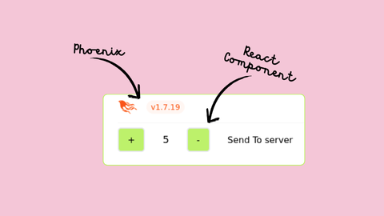

# Problem :

- We need SOME client side interactivity
- Our team has frontend developers who know react
- React has battle tested components
- I didn't want to add additional dependencies to our base phoenix project
- I wanted a mental model consistent with phoenix's way of working - heex, hooks and events



# Solution :

## Insert the following heex markup in your liveview code

```heex
<div id="counter-a" phx-hook="CounterHook" start={@count} />
```

This is what I meant by keeping the API consistent with how you would use a Phoenix Component using Phoenix Hooks.

## Create a file for your React Component

<code>assets/js/counter.js</code>
```jsx
import React, { useEffect, useState } from "react";
import { createRoot } from "react-dom/client";

const CounterComponent = ({ id, send, onReceive, start }) => {
  const [count, setCount] = useState(start);
  const [serverMessage, setServerMessage] = useState("");

  useEffect(() => {
    onReceive(`even`, (event) => {
      setServerMessage(event.msg);
    });

    onReceive(`odd`, (event) => {
      setServerMessage("");
    });
  }, []);

  return (
    <div className="flex flex-row gap-8 items-center ">
      <button
        className="border-2 rounded-md px-4 py-2 bg-lime-300"
        onClick={() => setCount(count + 1)}
      >
        +
      </button>
      <p className="text-lg">{count}</p>
      <button
        className="border-2 rounded-md px-4 py-2 bg-lime-300"
        onClick={() => setCount(count + 1)}
      >
        -
      </button>
      <button
        onClick={() => send("count-update", { id, count }}
      >
        Send To server
      </button>
      <p className="text-red-600">{serverMessage}</p>
    </div>
  );
};

export var CounterHook = {
  mounted() {
    let el = this.el;
    let id = el.getAttribute("id");
    let start = parseInt(el.getAttribute("start"));

    const root = createRoot(el);
    root.render(
      <CounterComponent
        id={id}
        start={start}
        send={this.pushEvent.bind(this)}
        onReceive={this.handleEvent.bind(this)}
      />
    );
  },
};

```

Some Notable points about the Hook :

1. In the <code>mounted</code> function we use client side javascript to parse attributes, format them and pass them as props to a React Component.
2. We mandate two props <code>onReceive</code> and <code>send</code> to be passed to every React Component so that it can communicate directly with the liveview process by sending and receiving events.
3. Sending an <code>id</code> prop, although its not enforced anywhere yet. This can be useful when you have multiple instances of the same component and you want to send an event from the server to any particular one of them.

Some Notable points about the React Component

1. Its familiar to react developers
2. We continue using tailwind for styling. This is a big win because I value being able to style my components in accordance with the rest of our app; so since we already use tailwind for the rest of the UI components, this is great.
3. To send events from the component to liveview, we use 
```jsx
<button onClick={() => send("count-update", { id, count }) > Send to server </button>
``` 
This looks a bit like the equivalent we have grown used to in heex. 
```heex
<button phx-click{"count-update"}>Send to server</button>
``` 
4. We use useEffect() to setup listeners for server events.

## Add an event handler in your liveview

```ex
def handle_event("count-update", params, socket) do
    count = params["count"]
    id = params["id"]

    socket =
      case rem(count, 2) do
        0 -> push_event(socket, "even", %{msg: "even"})
        1 -> push_event(socket, "odd", %{msg: "odd"})
      end

    {:noreply, socket}
  end
```

## Register the hook in app.js

This should be familiar to anyone who has used phoenix hooks.

```js
import { CounterHook } from "./counter";

let Hooks = {
  CounterHook,
  ... any other hooks you may have
};

let liveSocket = new LiveSocket("/live", Socket, {
  longPollFallbackMs: 2500,
  params: { _csrf_token: csrfToken },
  hooks: Hooks,
});
```

## Change esbuild configuration to support JSX

This part is new. In your config.exs, you need to add the loader flag - --loader:.js=jsx to the args option. The full value should look like 
```ex
args: ~w(js/app.js --loader:.js=jsx --bundle --target=es2017 --outdir=../priv/static/assets --external:/fonts/* --external:/images/*)
```

You are good to go now.

## Conclusion :
There are many places where you could abstract some things out to reduce code redundancy. Thats probably also why libraries like [live_react](https://github.com/mrdotb/live_react) exist and you should use them if apt. I like that this approach lets you add React components to an existing Phoenix project without adding any aditional dependencies. I also like that counter.js contains both the Phoenix Hook and the React Component. This makes the counter feel like a Phoenix component that handles markup, style, interactivity and communication with liveview; all in one file.

Full code is available as a [gist](https://gist.github.com/dennyabrain/a7056d1f4912ab63d5a3ee331105cd29). 
