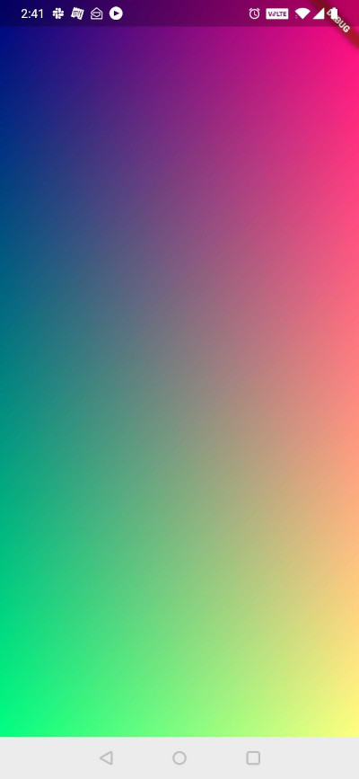

As participants in the Factshala Innovation Lab, we are building an in-classroom game about media manipulation. This came with a unique set of requirements :  
1. Develop a cross platform app for smartphones. 
2. Support low level access to network sockets to function even in low network or bad connectivity regions.
3. Support for image processing
   
We chose Flutter as the framework to implement this. One of the reasons for choosing Flutter was that flutter's APIs for working with shaders seemed very intuitive. Using the `CustomPainter` class you can use dart to control drawing operations on a canvas. And to this same class you can pass a fragment shader to control the painting.

We went from 0 to loading shaders, working with textures and implementing interactivity. This guide will serve as a retracing of steps to share what we learnt.

## Get barebones code : 
```
git clone https://github.com/dennyabrain/flutter_shader_demo.git
git checkout basic-setup
```

Try Running this project. It should launch an app :


## Interacting with shaders

### Loading Shaders
```dart
var program = await FragmentProgram.fromAsset('shaders/shader_tex.frag');
shader = program.fragmentShader();
```

### Passing Variables from flutter to shaders (uniform)
```dart
class ShaderPainter extends CustomPainter {
  final FragmentShader shader;

  ShaderPainter(FragmentShader fragmentShader) : shader = fragmentShader;

  @override
  void paint(Canvas canvas, Size size) {
    shader.setFloat(0, size.width);
    shader.setFloat(1, size.height);

    final paint = Paint();

    paint.shader = shader;
    canvas.drawRect(Offset.zero & size, paint);
  }

  @override
  bool shouldRepaint(covariant CustomPainter oldDelegate) => true;
}
```

## Footguns : 
1. Be mindful of unused variables within a shader. You might be setting uniform variables in the CustomPainter but if those variables are not being used in the shader, you will get out of index errors that left me clueless for a long time.

## Future Planned Lessons : 
1. Loading 1 texture
2. Loading 2 textures 
3. Interactivity

Various milestones are pushed as tags [here](https://github.com/dennyabrain/flutter_shader_demo/tags). You can always check out a particular tag to try out working stable code. 


## References
- https://medium.com/flutter-community/creating-custom-shaders-in-flutter-a-step-by-step-guide-49ec86bec20d
- https://medium.com/flutter-community/image-manipulation-with-shaders-flutter-aa11027b4a4d
- https://www.kodeco.com/25237210-building-a-drawing-app-in-flutter

## Contact
This is a work-in-progress post. Contact [denny](https://github.com/dennyabrain/) for feedback and clarifications.