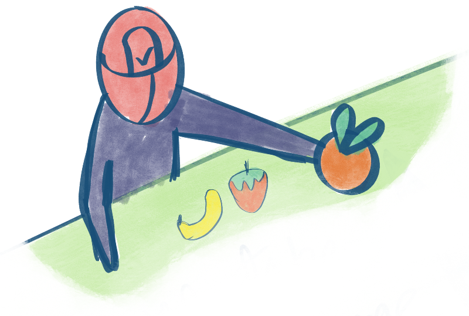

Over the last month I had the opportunity to talk to members of a few tech communities who told me that they have people with skills and time but they don't have impactful problem statements to work on. This was an amusing observation because I've often lamented to people about the exact opposite. While working at Tattle, I encounter hundreds of problem statements that could use some help but its hard to find the right people who are free at the right time.

These interactions left us motivated to dig into our bag of problem statements and put them together in a curated package.

We want to share 3 high impact issues we have identified by talking to [RATI foundation](https://ratifoundation.org/) and the [Deepfake Analysis Unit](https://www.dau.mcaindia.in/). These issues are about harms caused by non consensual sexual imagery and audio deepfakes. While it would be challenging to work on them alone, they all would gain so much from collaborative community participation. We've scoped these issues out into Github Issues so we can discuss approaches and work in the open to solve them.

|                                                                                                          |                                                                            |                                                                                                                                                    |                                                  |
| -------------------------------------------------------------------------------------------------------- | -------------------------------------------------------------------------- | -------------------------------------------------------------------------------------------------------------------------------------------------- | ------------------------------------------------ |
| 
  
     | Create a benchmark dataset for Audio Deepfakes                             | [tattle-made/feluda#365](https://github.com/tattle-made/feluda/issues/365 "Create a benchmark dataset of Audio Deepfakes")                         | Web Scraping, ML, REST API, Datasets, Annotation |
| 
  
     | Retrieve portions of non consensual sexual imagery in a video              | [tattle-made/feluda#365](https://github.com/tattle-made/feluda/issues/364 "Retrieve portions containing non consensual sexual imagery in a video") | Computer Vision, ML, Annotation                  |
| 
  
 | Repair Instaloader to scrape posts on Instagram by hashtag \`#web-scraping | [instaloader/instaloader#2206](https://github.com/instaloader/instaloader/issues/2206 "hastag.get_posts() doesn't seem to be working anymore")     | Web Scraping, Reverse Engineering APIs           |

## The Bigger Picture

All the chosen issues help address online harms in India.

We chose the broken Instaloader scraper because its a moderately popular Instagram scraper with many users. We know the amount of effort it takes to maintain a scraper. From the issues it looks like the scraper has been broken for a while and there's no one to fix it. This is our cue to help them. Selfishly, Instagram is very popular in India and being able to reliably scrape data from it is very useful. It is also one of the platforms where NCII appears and therefore organizations like RATI Foundation report to. Repairing this scraper can help their day to day operations.

In that vein, it also helps RATI Foundation if we can reduce the amount of time their team members have to spend reviewing videos to find portions with non consensual sexual imagery. Our second issue attempts at finding an ethical and working solution that can help scale their existing efforts.

The need for the audio deepfake benchmark dataset arose from our work with DAU. Increasingly they are finding audio to be a very commonly abused modality for deception on social media. Audio deepfake detection, especially in Indian languages, is increasingly difficult task. As innovation on deepfakes detection in audio continues, having a benchmark dataset will be useful. We are hoping to create a benchmark dataset that is fairly representative of the kind of data we get on Indian social media.&#x20;

As you can see, put together, these issues help us create a safer internet in India.

## Next Steps

If any of these issues are of interest to you, go to those issues and comment on them. We will reply with how to proceed :)

  

