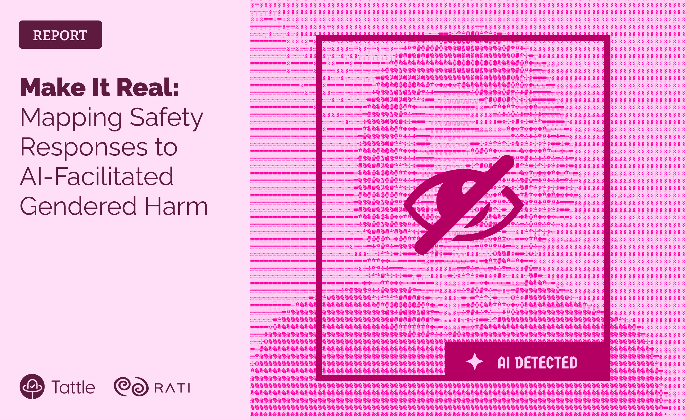

import {Box, Text} from 'grommet'
import {ExternalLink} from "../components/atomic/TattleLinks"

Today Tattle and Rati are releasing a report, Make it Real, a report that examines how AI-generated content, popularly known as ‘deepfakes’, is impacting and reshaping online harassment.

Drawing from cases reported to Rati's helpline Meri Trustline, the report reveals a concerning trend: while media & headlines often center on celebrities and politicians targeted through AI, a more personal crisis is also unfolding. Ordinary survivors are being targeted through images that are artificially generated but possess the capacity for real harm. Survivors’ reputation is attacked and consent is erased through technology. These violations are muted by shame, fear and trauma- the incidents are rarely revealed to close family circles, let alone feature in larger discourse. 

This report is based on the courageous calls that some survivors made to The Trustline. The salient findings of the report are:

- **Majority of Abusive Digital Manipulation Is AI-Generated.** Digital manipulation existed long before AI through manual edits, Photoshop or crude alterations but AI has transformed its speed and realism. Today, the majority of manipulated content reported shows some form of AI-generated or AI-enhanced imagery.

- **AI Creates Access & Violation Where No Offline Contact and Consent Exist.** 
In the majority of cases involving AI-generated sexual content, the perpetrator and target had no prior connection. AI was used precisely because the abuser lacked real-world access to the victim’s private images.  

- **AI Amplifies Misogyny placing Women and Marginalized Genders at Greater Risk.** 
While digitally manipulated content is also disproportionately targeted towards gender minorities (72% of the cases were targeted towards women), nearly all cases (92%) involving AI were targeted towards women.

- **Platform Safety Systems as Barriers, Not Safeguards.**
The biggest obstacle in securing a conducive response to a safety issue is the overall reporting system provided by a platform. On platforms where reporting any content is difficult such as X, reporting AI-generated content is also difficult. Platforms that define harm more “broadly”are more likely to address AI-generated content. Meme-like content, sitting in platform policy grey zone, continues to thrive even with AI-generated content

- **Copyright as a Personal Safety Tool.** 
Reporting the content under the DMCA for copyright infringement has often proven to be more effective in taking down offending content than framing and reporting the abuse under the category of gender-based harm.

- **Law Is Not the Gap. Access to Justice Is.**
Existing legal architecture in India can account for the risks of AI generated content. The key barriers are in applying existing legal provisions to gain recourse. There is a need to build the capacity of personnel across justice and enforcement systems to recognize and respond to manipulated content, in ways that are scientific, sensitive and clear of victim-blaming narratives.

This report aims to humanize these less visible experiences of AI Generated online abuse and provide new evidence on how the emerging technology is shaping digital vulnerabilities. 

If you are being harassed online or know someone who is, reach out and seek support. Call or WhatsApp Meri Trustline - 6363176363 Monday to Friday 9am to 5pm.

<Box className="w-fit mt-4 px-4 py-2 rounded-lg" background="visuals-1">
    <ExternalLink href="/make-it-real-report.pdf">
        <Text className="text-blue-950 no-underline">
            Read Report
        </Text>
    </ExternalLink>
</Box>