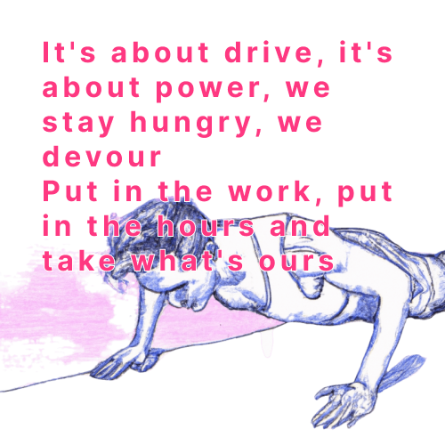

These were the broad topics or working groups that people in the gathering converged on, on day 3:

## Zombie Claims

- Research how Zombie Misinformation functions, what it means, how it works and why one time debunking does not work.
- Research wikipedia as a source for zombie misinformation
- Build tech to support research on zombie misinformation
- Work with Meedan’s claim matching tech to effectively kill zombie claims
- Wikipedia as a source for zombie misinformation
- Create Topic related fact check sites
- Build tech for detecting claim matching and similarity
- Hold platforms accountable and tell them tools they can use
- Tell platforms that they can use these systems
- Make this tech available for big and small platforms

### Reduce Debunking Latency

- Work with Meedan’s check tipline to tackle this
- Create popup news rooms around specific events
- Anticipating Misinformation and prebunking
- Create database of fact checks
- Use machine learning tools for detection
- Make this data available to different audiences (newsroom, individuals)
- Solve for claims reappearing in multiple languages by pre-translating every factcheck

## Platform Failure

- Explore whether self regulation can work. If not then how do you fix it with regulation?
- Compile the tech solutions that we should advocate for.
- Study How do people exploit anonymity to spread misinformation? Can we rely on algorithmic mechanisms for reducing virality from anonymous sources/ platforms?
- Think about tactics that leverage regulatory arbitrage (across geographies).

### Liberation from Big tech Platforms

- Create a data donation service
- Create a traceable archive for communities
- Archive for fact checked content (?)
- Build a tool that lets you post on short video platforms while also keeping local archives of content produced.

## Producing Content

- Create a Narrative show that shows how information or misinformation is a part of our daily family life.
  Beyond media literacy that is framed as wrong action.
- Create Educational curriculum for different age levels.
- Create content to different languages
- Study influencer educators to understand how they straddle objectivity and subjectivity
- Create content in multiple formats so the audiences can have a choice on what format they want to access the ‘fact check’ in.
- Ideate on Digital storytelling for fact checked content beyond long-form text storytelling
- Provide a digest to creators on what topics to tackle

### Increasing reach of Fact Checks

- SEO training
- Study and implement UI tweaks that work for different demographics

## Source Tracking

- Think about citational justice in terms of wikipedia
- Can you use a metadata tag/ poisoning to track networks.
- Libraries and archives are thinking of this in context of provenance and AI

## MIA Data

- A crowdsourced data directory
  - Pre-internet Tata used to create a dataset
  - Build Archives with access controls
    - See if we can join the factly project
- Activating networks for maintaining/cleaning datasets

## Data Void

- Assist Meedan's work on gendered disinformation:
  - Definitions are a problem (one form of a gender based violence)
  - Identifying gendered disinformation (support on tech for contextual detection).

## Critical Reading

- Make Media literacy curriculum content (targeted for age groups for critical thinking)
  - Keeping updated based on research
  - Work with those involved in existing curriculum
- Tabulating list of existing curriculum
- Cataloging ‘misinformation techniques’ (informal logics)

### Social media and archiving
- Archiving was a theme that came up in multiple working groups. The notes from the dedicated breakout session on the topic can be found [here](https://docs.google.com/document/d/1JwqgALWCH4oKAc0HoTztleW8eWDtL9RK01ul5RX0BHI/edit#heading=h.4cywptwoc66x).

## More documentation
The documentation on the work continuing from MisinfoCon is being maitained here: [https://tattle-made.github.io/misinfocon-india-docs/working-groups](https://tattle-made.github.io/misinfocon-india-docs/working-groups)
