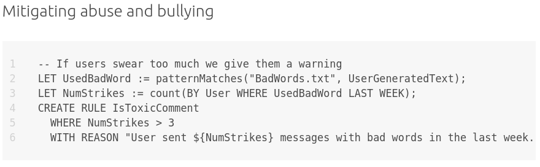

[SQRL](https://sqrl-lang.github.io/sqrl/index.html) is software used for abuse prevention at scale. It was used at many startups and later acquired by Twitter in 2018. On February 8, SQRL was open-sourced.

The project's website is a good way to learn the programming language and also get a sense of the kind of problems content moderators need to consider when operating at scale.

For instance, it is possible to deploy new rules and update blacklists in seconds. It was probably built like that to address how quickly conversations and abuse tactics change on social media. It is also built to be easily auditable, making it easy to understand why a particular rule was enforced.

The following snippet gives a good sense of how concise the language is (if you are familiar with programming and SQL). This SQLR program defines a rule that takes down an image if its detected to be nsfw by an ML model and the user who has reported the image doesn't have a history of false positives.

Throughout their website, amidst the talk about its features and syntax, the word "state" can easily go unnoticed. In computer science, a system's state is meant to be all the information that a program "remembers" or has loaded in its memory. In the context of social media, by state, SQRL is referring to all information a content moderation system must know about a user's behaviour to take informed decisions.

The reason SQRL emphasizes statefulness as being a core part of the languge is that a lot of abuse and suspicious behaviour can only be identified by keeping track of certain information wrt a user's behaviour. [Our twitter thread on this](https://twitter.com/tattlemade/status/1588502140213170181)

We've emphasized this in [other discussions](https://twitter.com/uli_pin/status/1597828365582729217) around Uli. The current Uli features on redaction of tweets or words, work on the level of content, and not behaviours. But protecting users against menacing behaviour needs us to build some 'state'

Has this person tweeted the same thing at you in the past? how often does this person interact with you? have you ever interacted with this person? A system might be able to make some informed decisions about allowing this comment or marking it for redaction on the user's feed.

But collecting such granular data on social media interactions can cross-over into surveillance. Centralized platforms such as Twitter, Facebook, LinkedIn all do this but we have come to accept them as key players of a surveillance economy. It is also easier for them to maintain these 'states' since all the interactions are centralized.

But as we try to invert these logics of centralized platforms with tools such as @uli_pin, we have to think through how to incorporate the best of a stateful system such as SQRL. After all, who wouldn't like a BlockSameTextInComment rule that marks repetitive comments? or a DemoteSpamFromSameUser rule that ensures that your feed is not filled with the same person's messages.

Is there any abusive behaviour that you encounter in your social media experience that you would like a personalized moderation tool to address? Comment [on our twitter](https://twitter.com/tattlemade) and we'll explore custom rules to detect those in a SQRL like manner.
