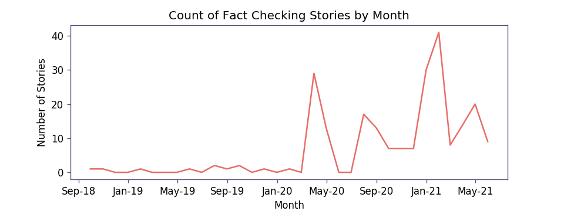

import VaccineHesitancyClusterVisualization from "../../../components/molecule/vaccine-hesitancy-cluster-visualization"
import {Accordion, AccordionPanel} from 'grommet'

# Vaccine Hesitancy

Renee DiResta spotted anti-vaccine content in her Californian neighborhood [back in 2015](https://epp.ok.ubc.ca/about/misinformation-age/renee-diresta/). It was in fact, how she first entered the space of misinformation- trying to tackle anti-vaccination content that could influence opinions that affected her children. Tracking Russian networks, the work that she is better known for came after.

The pandemic has forced attention back to health related misinformation. With vaccines being the only effective defense against the pandemic, content promoting skepticism around vaccines is especially dangerous. The content from fact checking sites is one way to track misinformation related to vaccines over time.

Here's a snapshot:

- Vaccine specific content relative to the total number of fact checking stories is low.
  - Of the over 26K stories, only 164 are explicitly about vaccines (<0.7%). The dashboard below provides summarizes the main themes in these 164 stories.
  - An addition 338 stories make a reference to vaccines. These might be stories that reference vaccines in context of another fact check. For example, [this 2017 report from FactChecker.in ](https://www.factchecker.in/health-ministers-claim-that-india-reduced-infant-maternal-deaths-faster-than-other-countries-false/)is on a claim around reduced infant mortality in India made at a vaccination drive in Tripura. Some [fact checks on Covid cures such as this one by AltNews](https://www.altnews.in/no-dr-ramesh-guptas-zoology-book-does-not-mention-a-cure-for-novel-coronavirus/), also emphasize the role of vaccines. Vaccines, however, are a sub-note in the fact checking story.
  - If we include these stories, the proportion of fact checking stories that reference vaccines rises to 1.9%.
- Most of the fact checking stories about vaccines are recent, but the first fact checking reports explicitly about vaccines came in 2018. There were two stories in 2018. One was by AltNews on the [Measles Rubella Vaccine](https://www.altnews.in/the-measles-rubella-mr-vaccine-myths-of-anti-fertility-agents-vaccine-related-deaths/). The other was by Quint Webqoof on [Oral Polio Vaccine.](https://www.thequint.com/news/webqoof/oral-polio-vaccine-contamination-hoax-message)

- If we look at the bigger dataset of fact checks that referenced vaccines, we find three by FactChecker.in in 2017:
  - [Jaitley Says TB Elimination By 2025; Target Would Need 95% Reduction In New Cases](https://www.factchecker.in/jaitley-says-tb-elimination-by-2025-target-would-need-95-reduction-in-new-cases/)
  - [Health Minister’s Claim That India Reduced Infant, Maternal Deaths Faster Than Other Countries False](https://www.factchecker.in/health-ministers-claim-that-india-reduced-infant-maternal-deaths-faster-than-other-countries-false/)
  - [Health Minister’s Claim That India Reduced Infant, Maternal Deaths Faster Than Other Countries False](https://www.factchecker.in/health-ministers-claim-that-india-reduced-infant-maternal-deaths-faster-than-other-countries-false/)
- There is some pro-vaccine related misinformation as well. One such claim about lungs of a vaccinated person was [checked by Factly.](https://factly.in/this-ct-scan-report-does-not-represent-the-lungs-of-a-covid-19-vaccinated-person/)

## The Dashboard:

We adapted our [fact checking sites themes dashboard ](https://services.tattle.co.in/khoj/dashboard/)to understand themes in vaccine related misinformation. This visualization displays the prominent themes in the 164 vaccine related stories. Articles are grouped into thematic clusters based on their headlines, using an algorithm called GSDMM. You can read more about the methodology on [the Fact Checking Sites Weekly Dashboard Page. ](https://services.tattle.co.in/khoj/dashboard/)

The clusters are left unnamed to allow for flexible interpretation. You can use the toggle button to select the level of granularity of analysis. A visualization with 7 clusters (circles) divides the 164 stories into more buckets, resulting in more key words being identified from the same content. A visualization with 5 clusters provides a more zoomed out view.

Clicking on a circle in that week will show the fact checking articles grouped in it and most prominent words in those articles.

<VaccineHesitancyClusterVisualization />

## Data Limitations

Click to expand

This analysis is based on content checked by IFCN certified fact checking sites. While fact checkers consider virality in the content they choose to fact check, it isn't the only consideration. The volume or content of stories fact checked is a signal but not a substitute for social media trends analysis.

We parse the primary topic of misinformation from the headline of a story. Manually combing through over a hundred fact checked stories weekly isn't feasible for a small team like Tattle. While headlines are an efficient way to automate summarization of misinformation trends, they can result in some relevant fact checks being left out. For example, this [fact checking story by Boomlive ](https://www.boomlive.in/fake-news/misleading-anti-mask-video-by-indian-youth-goes-viral-9367)is primarily debunking claims around anti-masking. But the video in question also contained claims promoting vaccine hesitancy. Since the headline did not mention the word vaccine, it was excluded from pool of 164 posts used to generate the dashboards.

## License

Contains information from Tattle Fact Checking Sites Database, which is made available [**here **](https://services.tattle.co.in/khoj/explore)under the[** Open Database License**](https://opendatacommons.org/licenses/odbl/1-0/) (ODbL). All the visualizations here are licensed under [**CC BY-SA 4.0**](https://creativecommons.org/licenses/by-sa/4.0/).
