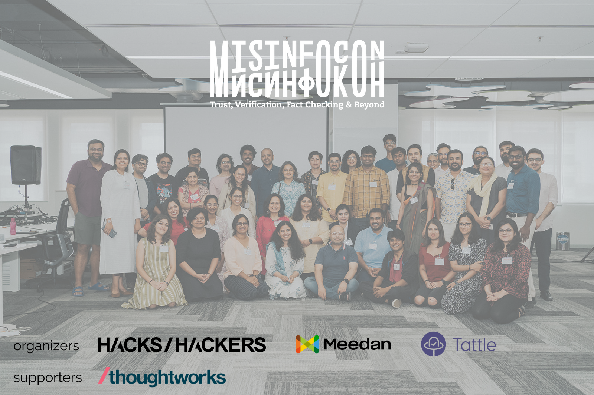

import { Box, Image, Link } from "grommet"

The MisinfoCon conference started as a concept at MIT Media Lab in February 2017. Since then, over ten MisinfoCon events have been convened across the world (Kyiv; Washington DC; Brazil; Perugia, Italy; and London). Misinfocon is a conference focused on fostering interdisciplinary conversations on misinformation research and response. 

The first Indian edition was held on May 12-14 at Thoughtworks Office in Bangalore. 
The conference convened technology, policy, media, and design professionals to cultivate an understanding and action around misinformation in India. The conference featured lightning talks and workshops for individuals and organizations working on researching and responding to misinformation in India. 

Touching on different aspects of trust and safety online, the conference will have a specific focus on:
- Platform Research
- AI and Media
- Storytelling and Misinformation
- Gendered Disinformation

## Useful Links

| | |
|---|---|
|[website](https://www.misinfoconindia.com/)|Event Website|
|[working groups](/blog/misinfocon-india-working-groups)|Write up on all the working groups that were formulated at the event |

## Contact

<Box round={"small"} background={"visuals-1"} pad={"medium"}>
    We're coordinating all efforts related to Misinfocon and its Working Group through a mailing list.
    Please email us at admin@tattle.co.in to be added to it.
</Box>

