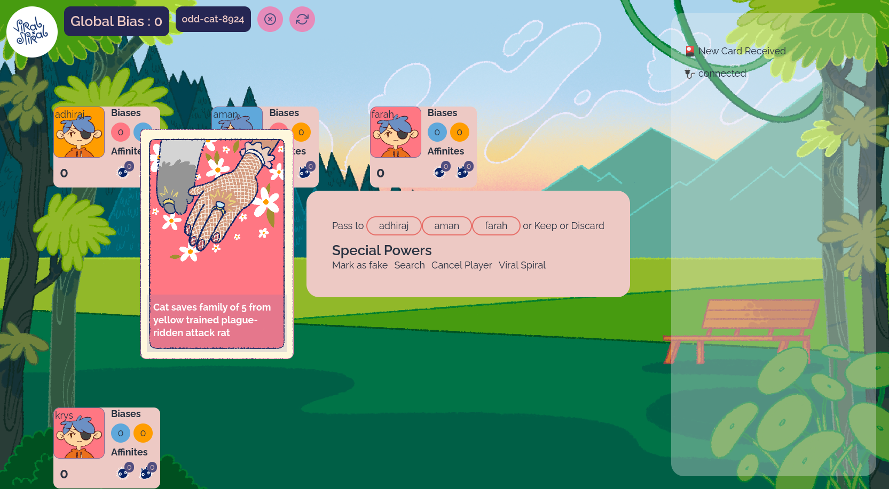

import DefaultLayoutNarrow from "@/components/default-layout-narrow";

export default function Layout({ children }) {
  return <DefaultLayoutNarrow>{children}</DefaultLayoutNarrow>;
}

# Presskit

## About Us

Viral Spiral is an adaptive digital card game about sharing news on the Internet. The game reflects the ways and reasons misinformation is shared, letting players experience first hand the temptation to share fake news for their own gain and face the consequences of the harm it causes around them.

Viral Spiral has been a team work initiated by Game Designer Adhiraj Singh and Game Developer Tattle Civic Technologies. Its is supported by the [Pluralism and Civic Exchange grant](https://www.mercatus.org/features/mercatus-program-pluralism-civil-exchange-announces-first-cohort-grant-recipients) from the Mercatus Center.

## Our team :

- Adhiraj Singh, Game Designer
- Aman Jotwani, Senior Game Writer
- Denny George, Product Engineer
- Farah Ahmad, Visual Designer and Illustrator
- Krys Martis, Game Writer
- Rishav Thaker, Fullstack Developer
- Tarunima Prabhakar, Researcher
- Mitali, Illustrator

## Video Walkthrough

<iframe
  width="560"
  height="315"
  src="https://www.youtube.com/embed/FbUeYm8ifWs"
  title="YouTube video player"
  frameborder="0"
  allow="accelerometer; autoplay; clipboard-write; encrypted-media; gyroscope; picture-in-picture; web-share"
  allowfullscreen
></iframe>

## Images

  

