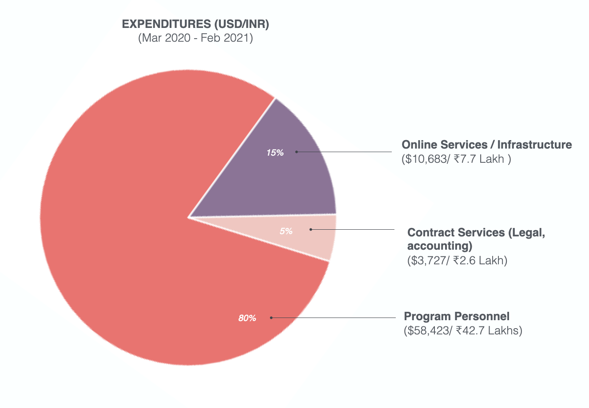

import DefaultLayoutNarrow from "@/components/default-layout-narrow";

export default function Layout({ children }) {
  return <DefaultLayoutNarrow>{children}</DefaultLayoutNarrow>;
}

# Annual Report

### (March 2020 - Feb 2021)

## Making Sense of a Pandemic

Tattle turned one on March 25 2020. This was also the day that India announced a nationwide lockdown, to slow down spread of the SARS-CoV-2 virus in the country. Tattle's second year is bookended by the first and second wave of Coronavirus in India. Remote work, social isolation, personal and collective tragedies warped our sense of time in this one year. For a group like Tattle, working on misinformation, there was no dearth of content or problem statements to drown in. Looking back, some events from 2020 feel like they happened eons ago. Others feel like they happened yesterday.

The year had its ebbs and flows. Some periods were very busy, with every person working on multiple projects in parallel. Some periods were slower, where we grappled with farcical legal notices from a platform in India. All of it led to valuable learning in our second year.
This report provides a snapshot of what turning two in the year of the pandemic meant for Tattle. This report needs to be prefaced with Tattle's goal, which is _to build datasets and tools to enable storytelling and response to misinformation in India_. Products and research were pursued in line with this goal.

## Tools Built

- [Tattle Khoj](https://services.tattle.co.in/khoj/): a service that tells you if an image has appeared in a fact-checking article.
- [WhatsApp Scraper](https://tattle.co.in/products/whatsapp-archiver/): this scraper consolidates and de-identifies chats exported from WhatsApp into a database. It de-duplicates, manages time lags in exports of the same chat, and links media items to the database. 
- [Tattle Kosh](http://kosh.tattle.co.in/) : While we've always had a data archive of some sort powering our backend, we rewrote
  the archive with a focus on creating shareable datasets. Kosh also supports sign ups now, which means anyone can access the archive without requesting access from us.
- Dataset of Posts from Indian Social Media: We wrote scrapers to archive social media posts from an Indian social network. Through an 8 month period spanning the pandemic in India, we gathered over a TB of videos and images. The scraper and data have been taken down temporarily due to aforementioned legal issue.

## Research

- We created a dataset on '[Prioritizing User Generated Multi-Media Content for Fact-Checking'](https://arxiv.org/abs/2010.13387). This dataset was motivated by our need to identify content that can be fact checked, in the troves of data we collect. Showing million plus posts unfiltered on Kosh wouldn't serve the purpose of the archive, which is to help people understand misinformation related trends on social media in India. This dataset can help train machine learning models for parsing content that contains factual claims and thus can be fact checked.
  - This dataset was accepted at [ICWSM 2021](https://icwsm.org/2021/#accepted_papers). The peer review process gives us confidence that our methodology can be extended to create larger datasets. One of our findings from creating this dataset was that 28% of memes contain factual claims. In separate work also explored the importance of incorporating memes and consequently narratives in [IFCN style fact-checking work](https://www.buzzfeednews.com/article/craigsilverman/facebook-and-fact-checkers-fight-fake-news).

- We co-authored a paper on '[Ethical Approaches to Closed Messaging Research: Considerations in Democratic Contexts](https://electionstandards.cartercenter.org/verifying-elections-misinfocon2020/ethical-approaches-to-closed-messaging-research-considerations-in-democratic-contexts/)', released by the Carter Center and Misinfocon. This paper discusses issues of user consent, privacy and data governance in research on WhatsApp, Signal and Telegram.

## Community Use Cases:

The Fact Checking Sites Database was requested by over 30 researchers and journalists. The following academic papers and media reports used this data:

- Misinformation as a Window into Prejudice: COVID-19 and the Information Environment in India, CSCW, Syeda Zainab Akbar, Anmol Panda, Divyanshu Kukreti, Azhagu Meena, Joyojeet Pal. [LINK](https://www.microsoft.com/en-us/research/publication/misinformation-as-a-window-into-prejudice-covid-19-and-the-information-environment-in-india/)
- The strange, sometimes sinister conspiracy theories on Sushant Singh Rajput’s death that flourished on social media. Venkat Ananth, ET Times. [LINK](https://economictimes.indiatimes.com/tech/internet/the-strange-sometimes-sinister-conspiracy-theories-on-sushant-singh-rajputs-death-that-flourished-on-social-media/articleshow/78636570.cms)
- Coronavirus: The human cost of fake news in India. Shruti Menon, BBC Reality Check. [LINK](https://www.bbc.com/news/world-asia-india-53165436)
- Increase in Communal Tone in COVID-19 Fake News in India: Study. Syeda Zainab Akbar, Divyanshu Kukreti, Somya Sagarika, Joyojeet Pal (University of Michigan). [LINK](https://www.thequint.com/news/webqoof/increase-in-communal-tone-in-covid-19-fake-news-in-india-study)
- Temporal Patterns in COVID-19 misinformation in India. Syeda Zainab Akbar, Divyanshu Kukreti, Somya Sagarika, Joyojeet Pal (University of Michigan).[LINK](http://joyojeet.people.si.umich.edu/temporal-patterns-in-covid-19-misinformation-in-india/)

The Social Media Datasets have been shared with a few academics. We hope to see academic papers based on this dataset in the coming months.

## Talks

- WhatsApp and Misinformation in India. The Bachchao Project's: The Glassroom- Misinformation Edition with Tactical Tech.
- Panel on Backdoors to Encryption. NIPFP, Data Governance Network. [LINK](https://twitter.com/DataGovNetwork/status/1335833999944470528)
- Winter School: Online and On The Line: Democracy in the Age of Machine Intelligence, CITAP, IIIT Bangalore. [LINK](http://citapp.iiitb.ac.in/online-and-on-the-line-democracy-in-the-age-of-machine-intelligence/)
- Paper Presentation "Prioritizing User-Generated Multimedia Content for Fact-Checking", Credibility Coalition.
- Archives and Crises. International Archives Week, Milli Consortium, Archives at NCBS. [LINK](https://www.youtube.com/watch?v=mtIaD-AvG_U)
- Mining information from social media for fake news detection. Hasgeek. [LINK](https://hasgeek.com/fifthelephant/mining-information-from-social-media-for-fake-news-detection/)

## Financials

### Revenue:

- [AI Ethics Grant](https://aiethicsinitiative.org/news/2019/3/12/announcing-the-winners-of-the-ai-and-the-news-open-challenge): 100K USD
- Personal Capital

### Expenditure:

The primary cost drivers for the project this year were:

- Full-time Staff for the Project
- Technical Infrastructure
- Contract services such as legal and accounting advice
  
  
  

## Contributors/Collaborators:

- Through this year, several people have worked with and helped the project grow:
  - Anushree Gupta: Led research on chech worthy claims in multimedia content.
  - Eishita Chetri: The source of all the beautiful illustrations in Tattle creatives.
  - Harman Singh: Built the Tattle Android App.
  - Kruttika Nadig: Led data science work at
  - Onish Garg: Wrote a scraper for multiple fact checking sites.
  - Rishabh Jain: Made the weekly fact checking sites dashboard happen.
  - Saakshita Prabhakar: Continued to support on design needs at Tattle.
  - Saumya Gupta: Helped us think through what content should or should not be accessible on the archive.
  - Suraj Sharma: Helped us create a proof of concept UI for moderating and importing whatsapp chat export data into our database.
  - Swair Shah: Continued to provide assistance and guidance for all things ML.
  - Yohan Matthew : Helped us investigate container orchestration frameworks and implemented a kubernetes driven CI/CD development process.
