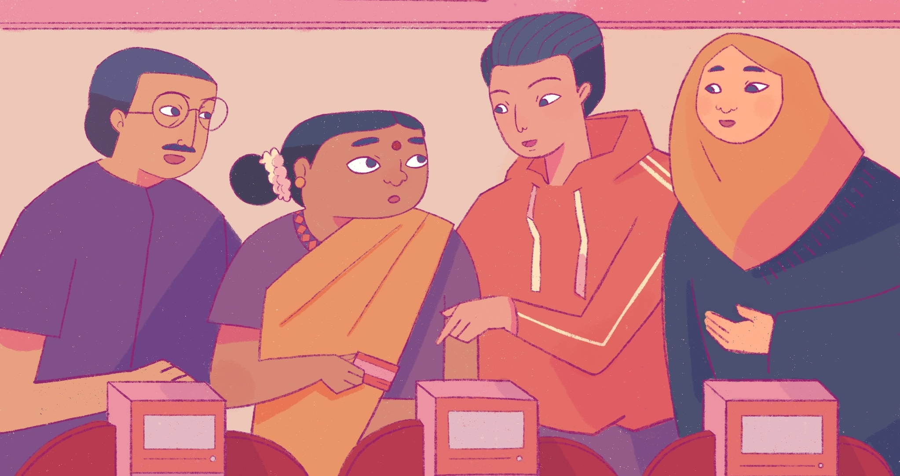
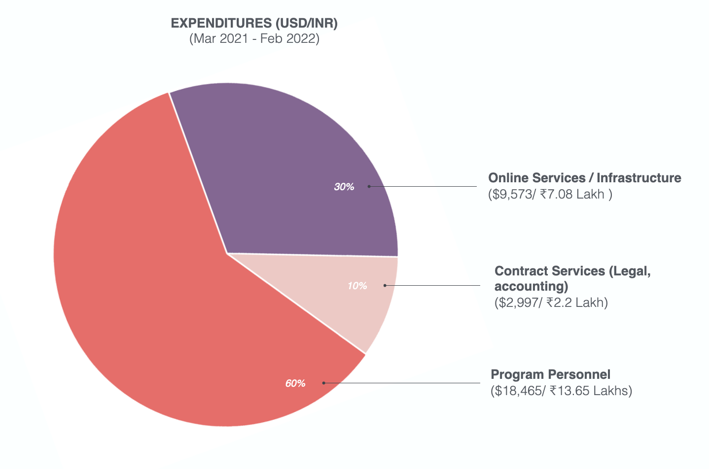

# Annual Report

### (March 2021 - Feb 2022)

 

In March 2022, Tattle turned three. As is the general style of understatement at Tattle, we didn't notice it. Preoccupied with deadlines and project deliverables, we didn't commemorate another year. Writing this report, then is our opportunity for reflection on how the organization is evolving. 

In the last [annual report](2020-report.mdx), we stated Tattle's goal: to build datasets and tools to enable storytelling and response to misinformation in India. Through our work over the last few years we have realized that the lines between hate speech and misinformation are increasingly blurred. We thus, find ourselves working beyond just misinformation, and also on response tools for hateful content. 

2021 feels like an important year for Tattle for many reasons. Tattle's vision is to a be lean, grounded team with tech prowess that amplifies the work of other organizations. In 2021 we launched an ambitious project with The Center for Internet and Society to develop a user facing plugin to respond to online gender based violence. By the start of 2022, we had launched two other collaborations. As we turn three, we take some pride in sticking with our vision of *how* we wanted to work in the civic tech space in India, even though it often appeared to be the more challenging route. Work continues, and there is a lot more to learn. But, this is a retrospective of all that went right. 

## Products:

The bulk of the year was devoted to developing two projects:

- In collaboration with the Center for Internet and Society, we devloped a user facing Twitter plugin to respond to online gender based violence in Indian languages. The plugin, now called Uli, is novel for a number of reasons. First, is its focus on Indian languages that see lower representation in content moderation. Second, the plugin is being developed with the support of activists at the receiving end of online gender based violence. Third, the machine learning work is driven by what people at the receiving end of online gender based violence find problematic. More importantly, the use of machine learning is subservient to the goals of the tool. Other features on the tool include the ability to archive content and request help from others in responding to a post. 

- We worked on the second iteration of Tattle's flagship project, [Kosh](https://github.com/tattle-made/kosh-v2). We built a robust sign-up/ authentication flow which now allows general public to sign up to [the platform](http://kosh.tattle.co.in/). We also refactored the index and search functionality so that search is more scaleable, and more resilient to errors. With support from [Thoughtworks](https://www.thoughtworks.com/about-us/social-change), we also built a UI to manage and monitor all these processes. This drastically decreases the tech proficiency needed to manage different data sets on Kosh.

- We worked on smaller self contained projects such as [the memebox](https://github.com/tattle-made/memebox) at FOSS United. The tool lets you bookmark memes, annotate them and read commentary on them. We also expanded on the annotation UI that we prototyped first for our [CheckMate dataset](https://ojs.aaai.org/index.php/ICWSM/article/view/18126) in 2020, for Uli. The annotation UI is also evolving as a standalone tool that can be adapted for a number of ML annotation tasks. 

## Research

- We presented our paper '[A Contextual Inquiry of IFCN](https://www.4sonline.org/185-the-post-truth-age-what-is-this-really-about/)' at the Panel on Post Truth Age as a part of The Annual Meeting of the Society of Social Study of Science.
- We released a report, [Crowdsourcing Aid: A Case Study of the Information Chaos During India's Second Covid-19 Wave](https://tattle.co.in/articles/covid-whatsapp-public-groups/)' that looked at how relief work was being coordinated on WhatsApp during the second wave in India. 
- We presented a short paper on the '[A Contextual Inquiry of The International Fact-Checking Network and Factuality on Social Media'](https://a%20contextual%20inquiry%20of%20the%20international%20fact-checking%20network%20and%20factuality%20on%20social%20media/) at the workshop on [Information Credibility & Alternative Realities in Troubled Democracies](https://zivepstein.github.io/info-credibility-workshop/index.html) at ICWSM 2021.
- We presented at the First Annual Conference of The [Platform Governance Research Network](https://www.platgov.net/program.pdf). The presentation titled 'Against Platform Universalism: A Case Study of Platform-Seeded Trends and Non/Algorithmic Paternalism from India' was a working paper based on our analysis of trends on a platform in India.

## Talks
- Tek Fog: Dangerous New World. The Wire. [[LINK](https://twitter.com/onosmosis/status/1482980287458193412)]
- Beyond Commerce: Working on Tech that Benefits Society. Through the Corporate Glass Podcast. [[LINK](https://www.throughthecorporateglass.com/tech-benefit-society)]
- Crawling the Web for Poetry with (Draft)[https://dra-ft.site/]. [[LINK](https://youtu.be/EBRC6dt62Ts)].
- Between Fake and The News: The Long Game Against Information Disorder. IIT Jodhpur, Digital Humanities Series.

## Community Use Cases:
Aisha Majid at The New Statesman used the fact checking sites data to describe widespread 'Misinformation about minorities in India'. [[LINK](https://www.newstatesman.com/international-politics/society-international-politics/2021/10/misinformation-about-minorities-in-india-is-widespread-and-getting-worse)]

## Financials

### Revenue:

The revenue sources for the year were:
- The Digital Society Challenge alongside the Centre for Internet and Society: 
  -  To Tattle: USD 13684/ INR 1,011,715
- Grant for the Web project with Monk Prayogshala:   
  -  To Tattle: USD: 44505/ INR: 32,90445.9 (also for 2022-2021)
- Personal Capital: USD 7574/ INR 5,60,000

Conversion rate used: $1 = INR 73.9339

### Expenditure:

The primary cost drivers for the year were:
- Full-time Staff for the Project.
- Technical Infrastructure.
- Contract services such as legal and accounting advice.
  
  

Conversion rate used : $1 = INR 73.9339

## Contributors/Collaborators:

- Ambika Tandon, Brindaa Lakshmi and Cheshta Arora at the Center for Internet and Society.
- Arathy Puthillam and Hansika Kapoor at Monk Prayogshala.
- Guru Prasad and Satish Viswanathan at Thoughtworks who volunteered on Kosh. 
- Maha Jinadoss: Data Science Intern supporting on machine learning for Uli.
- Rahul Dev Korra: Full time data engineer who worked on Uli and Kosh.
- Saakshita Prabhakar: Designed the 'Crowdsourcing Aid' report and advised on other design needs at Tattle.
- Swastika Mohapatra: Data analysis intern who worked on fact checking sites data.
- Swair Shah: Worked on the ML for analysing of media for the Crowdsourcing Aid report; and continued ML development for Kosh. 
- Tanima Saha: Provided editorial inputs on the WhatsApp report.
- Yohan Matthew: Helped us investigate container orchestration frameworks and implemented a kubernetes driven CI/CD development process.
