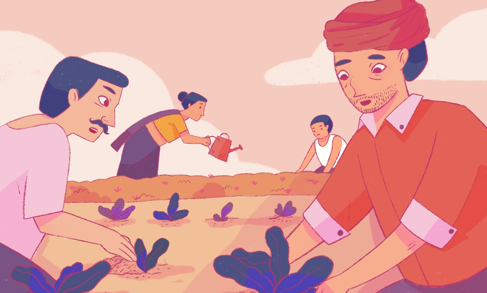
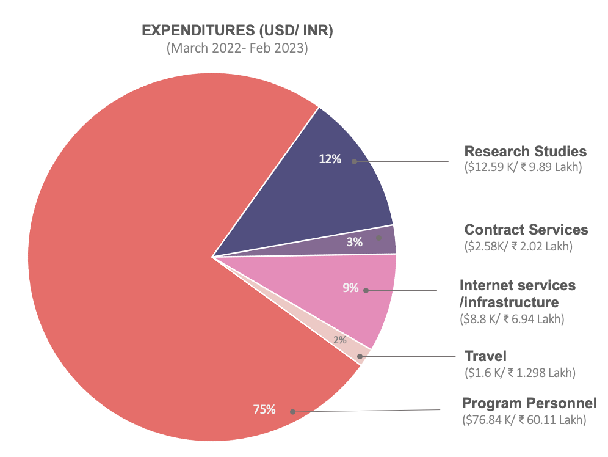

import DefaultLayoutNarrow from "@/components/default-layout-narrow"

export default function Layout({ children }) {
  return <DefaultLayoutNarrow>{children}</DefaultLayoutNarrow>
}

# Annual Report

### (March 2022 - Feb 2023)

We're four already! Time goes by fast.

A statistic repeated on the Internet (without a source) is that 50% of startups fail by year five. We don't think of Tattle as a start-up- there is no unyielding chase for growth, be it of profits or of users. As we have emphasized in the past, the process -or the 'how'- of building is as, if not more important, as the what of building. Four feels like a ripe young age. We've managed uncertainty and weathered some storms. On the whole, we have a better sense of our capabilities and limitations. Year four was rather exciting- one in which the wisdom of our capabilities translated into execution of multiple projects. In 2022, we were working with four projects:

**Uli:**

Uli, our project on enabling collectinve response to online gender based violence, started in 2021. It was a collaboration with the [Centre for Internet and Society](https://cis-india.org/) and supported through a grant from the Digital Society Challenge. 2022 was the year to deliver the first beta.

**Viral Spiral:**

Viral Spiral is a multi-player media literacy game to explain the consequences of sharing polarizing information. The game was developed in partnership with Adhiraj Singh and received initial funding from the [Pluralism and Civic Exchange Fund](https://www.mercatus.org/economic-insights/expert-commentary/pluralism-and-civil-exchange-micro-grants) at the Mercatus Center.

**Releasing Standardized Metrics from GitHub:**

We worked with GitHub's Social Impact and Policy teams for developing metrics from GitHub to inform economics research, public policy and international development.

**Using Web Monetization for Incentivizing Sharing of ‘Good’ Content:**

This was a joint project with [Monk Prayogshala](https://www.monkprayogshala.in/) to study the incentives for sharing accurate information. It was funded by [the Grant for the Web.](https://www.grantfortheweb.org/blog/announcing-our-newest-cohort-of-awardees)

The project with GitHub and Monk Prayogshala were time-boxed projects. Uli and Viral Spiral on the other hand were multi-year bets. We knew it was going to be a busy year, and one that required context switching between different project types. But it was organizational growth that we embraced.

By the end of 2022, we had concluded the study on using Web monetization to share 'good' content, and submitted our report to GitHub. We launched Uli, and got feedback for the next iteration. After numerous playestes, in January 2023, we were ready to play the game with school students in Kerela.

## Research

## Uli Related:

- Arora, A., Arora, C., & J, M. (2023). Designing for Disagreements: A Machine Learning Tool to Detect Online Gender-based Violence. In Feminist Perspectives on Social Media Governance. IT for Change. [LINK](https://itforchange.net/feminist-perspectives-on-social-media-governance-0)
- Arora, C., & Prabhakar, T. To think interdisciplinarity as intercurrence: Or, working as an interdisciplinary team to develop a plug-in to tackle the experience of online gender-based violence and hate speech. 2021. ⟨hal-03505844⟩

### Incentivizing Sharing of Good Content:

- Kapoor, H., Rezaei, S., Gurjar, S., Tagat, A., D., Budhwar, Y., & Puthillam, A. (2022, November 22). Does Incentivization Promote Sharing “True” Content Online?. [LINK](https://doi.org/10.31234/osf.io/nykxz)

## Talks

- Tech for Truth, Misinformation Regulations Conference, IIT Madras, Shastra. [LINK](https://www.linkedin.com/posts/shaastra-iit-madras_debunk-fakenews-misinformation-activity-7023688631433261056-yOxu)
- UNFPA Consultation on Tackling Tech-Mediated Online Gender-Based Violence. (No Link to event)
- Regional Convening on Challenging Hate Narratives in Asia Conference, APC. [LINK](https://www.apc.org/en/project/challenge)
- The Truth is Out There, Mozilla IRL Podcast, The Truth is Out There — The Internet Health Report 2022. [LINK](https://2022.internethealthreport.org/episodes/the-truth-is-out-there/)

## Financials

The revenue sources for the year were:

- Revenue from consulting: USD 32,000/ INR: 25,15,200
- Pluralism and Civil Exchange Grant for Viral Spiral: USD 32,000/ INR: 25,15,200
  Conversion rate used: $1 = INR 78.6

Continued from 2021:

- Grant for the Web project with Monk Prayogshala:
  - To Tattle: USD: 44,505/ INR: 32,90445.9 (also for 2022-2021)
    Conversion rate used: $1 = INR 73.94

## Expenditures

The primary cost drivers for the year were:

- Full-time Staff for the Project.
- Research costs including paying study participants, and researchers
- Contract services such as legal and accounting

  

    
  

## Contributors/Collaborators:

All our projects were made worthwhile by the fantastic people and organizations that joined us on them. In our traditional style (see past [annual reports](https://tattle.co.in/report/) the list would take up an entire page (yay!). So we're adapting and grouping the project teams together.

### Project Specific:

- Viral Spiral Collaborators: Adhiraj Singh, Aman Jotwani, Farah Ahmad, Rishav Thaker, Krys Martys, Mitali Pangati
- Uli Collaborators: Ambika Tandon, Arnav Arora, Brindaalakshmi, Cheshta Arora, Shagnik Chakraborty, Twisha Mehta

### Organizational Wide:

- Aurora: Accessibility and security engineer
- Bhargav Dave: Junior fullstack developer
- Gurpreet Luthra and the Social Impact team at Thoughtworks. Gurpreet mentored us on engineering project management.
- Mahalakshmi Jinadoss : Data Scientist
- Rahul Dev Korra : Data engineer
- Sarvesh Tiwari: Project Management mentorship
- Upasana Bhattacharjee: Qualitative research
- Yash Budhwar: Operations, comms, HR
- Yohan Mathew : ML DevOps
