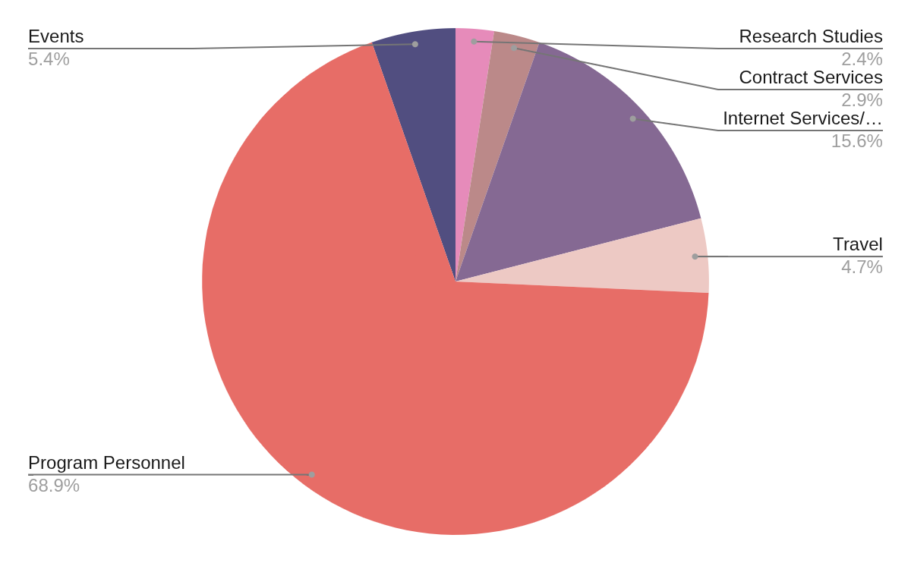

import DefaultLayoutNarrow from "@/components/default-layout-narrow"

export default function Layout({ children }) {
  return <DefaultLayoutNarrow>{children}</DefaultLayoutNarrow>
}

# Annual Report

### (March 2024 - Feb 2025)

Six. As children, when we learnt to count, six was when you knotted up the old sticks, and started a new bundle. That is  a good metaphor to describe our sixth year.

Our sixth year was "[the biggest election year in human history](https://www.undp.org/super-year-elections)". Sixty plus countries, and over three billion people across the world, voted. Generative AI gate crashed, in an already fragile information ecosystem.;

We started our year with our heads and knees deep in the tech behind the Deepfakes Analysis Unit. We had two months to set up the WhatsApp tipline and dashboard for collective analysis of AI generated content. It was the perfect opportunity to leverage and mark five years of work. It was a new challenge but we knew we had the building blocks in place to get it done.

Till the summer, until after the elections were over, we were in alert mode, making sure that there was no down time during the election season. Year six was marked by three big projects:

1. Deepfakes Analysis Unit:
While DAU was launched in year five, the meat of the work was in year six . Since April of 2024 we have added more languages, improved the reliability of message delivery and improved the machine learning systems that cluster similar media items. The DAU WhatsApp chatbot has been used by over 10,000 individuals, including fact checkers, across the world. DAU has been [featured by The New York Times](https://www.nytimes.com/2024/06/01/world/asia/india-election-deepfakes.html), and received the award for the “[Most Innovative Collaboration](https://www.poynter.org/fact-checking/2024/fact-checkers-from-turkey-india-and-georgia-win-globalfact-11-awards/)” at Global Fact 11.

2. [Building AI Safety Benchmarks with MLCommons](https://tattle.co.in/products/ml-commons-safety-benchmark/)
As a pilot project selected by [MLCommons](https://mlcommons.org/), we tested the expert led participatory methodology that we piloted with Uli, to create contextually relevant safety benchmarks in Hindi.

3. Uli:
We continued to grow the Uli dataset through crowdsourcing sessions. We also added features to the plugin so that people can contribute words to the public collection of slur words directly through the plugin. Users can also now view the meaning of the slurs that show up on their websites by hovering on the words.

The Uli dataset itself is being used by platforms and researchers to better understand and remove hateful content.

## Community Building:

It was also our biggest year in terms of community building around our work, and indirectly towards open source projects:

- We put together the second edition of [MisinfoCon India](https://www.misinfoconindia.com/ "MisinfoCon India 2025"), with support from Hacks/Hackers and Thoughtworks . The two day cross-disciplinary gathering touched on themes of AI and misinformation, financial scams and the future of decentralized platforms.
- Tattle partnered with University of Amsterdam and Aapti institute to put together a two day workshop on Mapping Data Work.
- We participated in Samagra Foundation's Code4GovtTech program with three projects: Feluda, Uli and the a UX project around the Deepfakes Analysis Unit. We mentored four contributors through three months. All the contributions were notable and some of the contributors continued to work with us after the three months of the program.
- We mentored budding community managers through GitHub's community based volunteering program that aims to increase contributions to open source projects that further SDGs.
- We were generously hosted at TinkerHub for a week. We spoke to the students there about the need to do socially grounded work that starts from the needs on ground, rather than the tech at hand.
- We joined the advisory group for the 2025 UNFPA Global Symposium on technology-facilitated gender-based violence (TFGBV)
- We created an online module as a Knowledge Partner for the School of Campaigners, a joint initiative of Access Polity (NETRI) & Apolitical Foundation, focused on OGBV and its impact on women politicians.

## Research

- We published a report to evaluate the performance of text-in text-out Large Language Models (LLMs) to [understand and generate Indic languages.](https://arxiv.org/abs/2501.13912)
- We wrote [a report](https://drive.google.com/file/d/1OKpZ7qqT6hjbzaeUC7UnBF1oCTn7c70z/view "Tattle-MLCommons_Hindi-AISafety-Benchmark-Datasets_FINAL.pdf") for MLCommons on creating [safety benchmarks](https://mlcommons.org/ailuminate/methodology/) on sex related crimes and hate in Hindi, with expert insights.&#x20;
- The [Uli dataset paper](https://aclanthology.org/2024.woah-1.16.pdf) received the Outstanding Paper Award at the Workshop on Online Abuse and Harms, held at the NAACL 2024.

## Talks:

The Tattle team had a busy travel schedule last year. Following is the list of notable talks:

- We presented our paper on Indic Language Performance in LLMs at the Agency Fund's AI For Global Development Event.
- We spoke at three events at RightsCon, 2025 in Taipei on AI and misinformation, AI enabled gendered abuse, and our work with the Deepfakes Analysis Unit.
- We spoke about the digital gender divide at the Asia-Pacific Ministerial Conference on the Beijing30 review, organized by CEVAW and the Australia eSafety Commission.
- We spoke at the Association of Internet Researcher's symposium in Hyderabad on the theme of building a more just and fair internet through design, code, and content.

## Revenue

- Revenue from technical consulting: INR 11,366,200/ USD 132,985
- Grant from Nummun Fund: INR 826,600 / USD 10,000
- Events: INR 30,474

  \
  \
  Conversion rate used: $1 = INR 85.47

## Expenditures

The primary cost drivers for the year were:

- Full-time Staff for the Project.
- Infrastructure costs for running our projects
- Travel costs associated with events and conferences

### Contributors/Collaborators:

### Project Specific: 
- MisinfoCon: Saurav Verma
- Uli: Srravya Chandramowli
- DAU: Yogesh GiriKumar
- MLCommons: Mamta Singh, Mansi Gupta, Saumya Gupta, Saurav Verma, Srravya Chandramowli

### Organization Wide:
- Aatman Vaidya: Fullstack developer
- Aurora: Accessibility and security engineer
- Kaustubha Kalidindi: Uli Program Manager and Legal Counsel
- Maanas Bhardwaj: Fullstack developer
- Manisha Kumari: Junior Fullstack developer
- Yohan Mathew : Advisor
- Yash Budhwar: Operations, comms, HR
  

